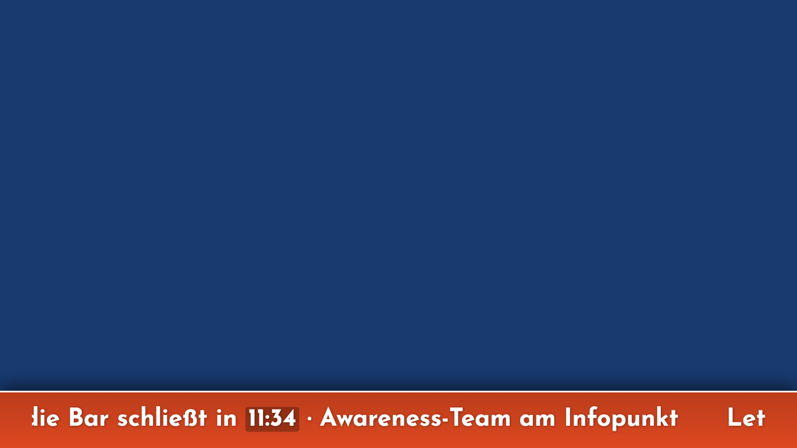
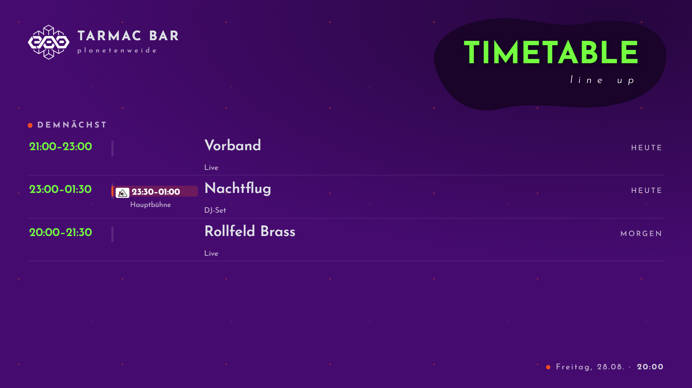
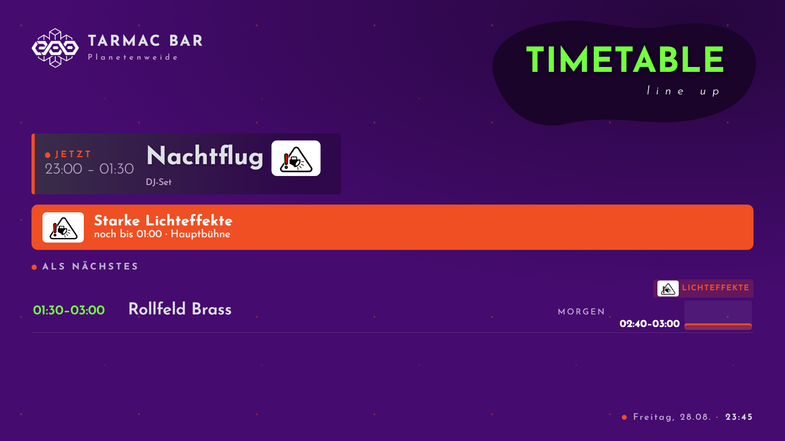
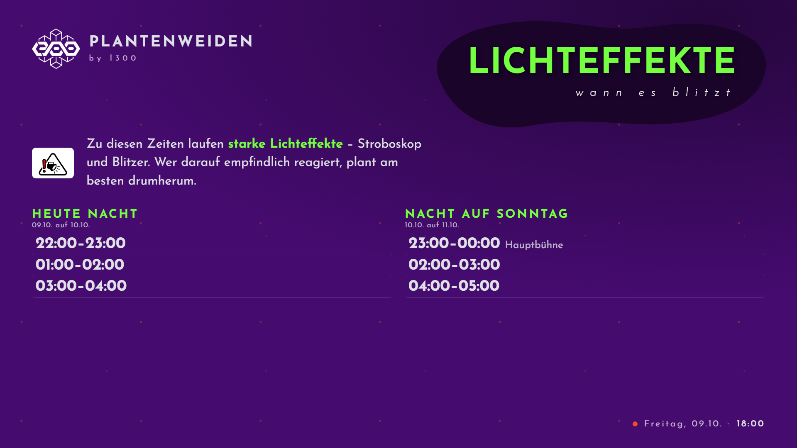
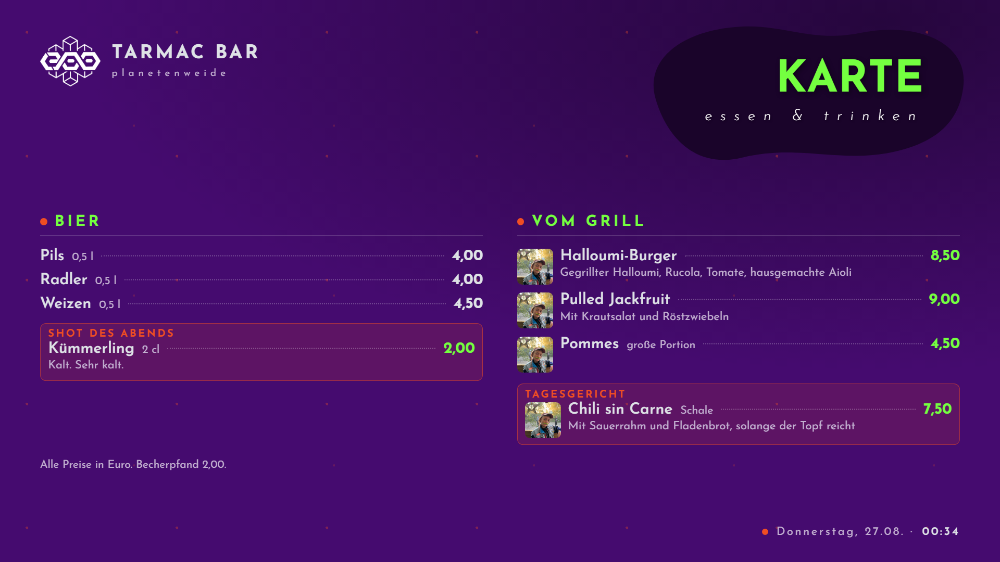
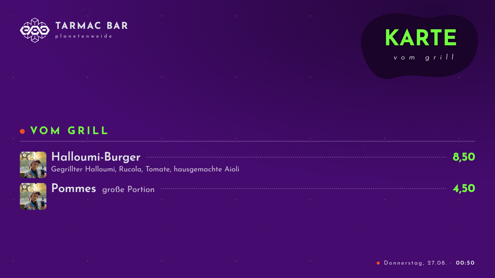
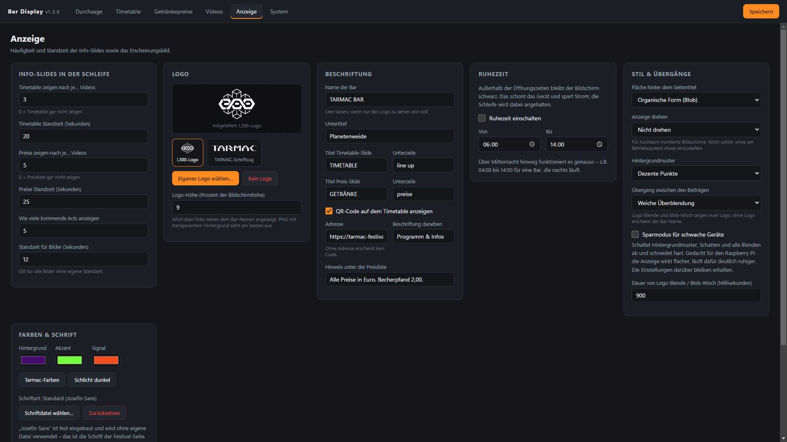
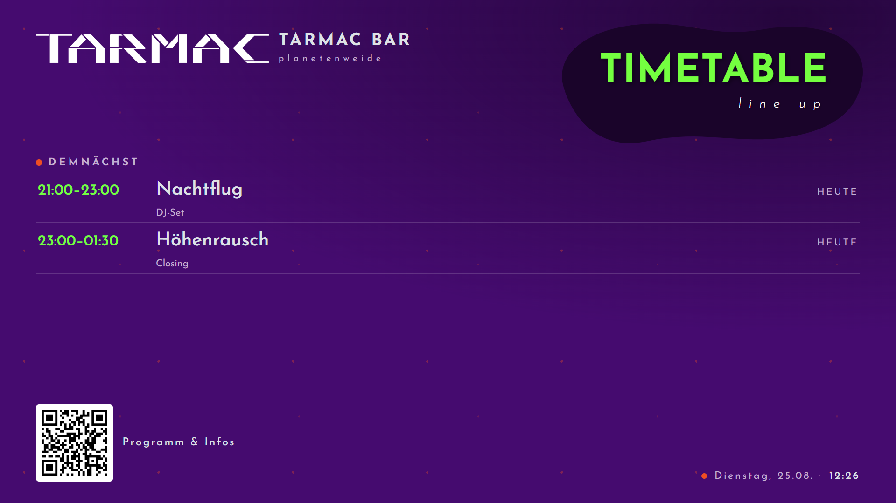
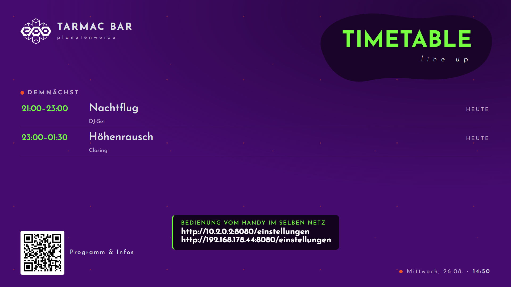

# Bar Display

Anzeigeprogramm für die Bildschirme an den Bars des Tarmac Festivals. Werbeclips laufen
in einer Endlosschleife, dazwischen erscheinen der aktuelle Timetable und die
Getränkepreise im Festival-Design.


---

## Inhalt

- [Was das Programm kann](#was-das-programm-kann)
- [Einrichten an der Bar](#einrichten-an-der-bar)
- [Bedienung](#bedienung)
- [Die Anzeige](#die-anzeige)
- [Die Einstellungen](#die-einstellungen)
- [Bedienung vom Handy](#bedienung-vom-handy)
- [Mehrere Bars ausstatten](#mehrere-bars-ausstatten)
- [Raspberry Pi](#raspberry-pi)
- [Unterstützte Formate](#unterstützte-formate)
- [Wo die Daten liegen](#wo-die-daten-liegen)
- [Wenn etwas klemmt](#wenn-etwas-klemmt)
- [Für Entwickler](#für-entwickler)

---

## Was das Programm kann

- **Endlosschleife** aus Videos und Standbildern, startet sofort im Vollbild, immer stumm.
- **Zeitsteuerung pro Beitrag** – „immer" oder beliebig viele Zeitfenster wie
  *Fr + Sa, 20:00–02:00*. Fenster über Mitternacht funktionieren.
- **Timetable** mit Datum, Uhrzeit, Act und optionalem Foto. Die Anzeige hebt den
  laufenden Act hervor und zeigt darunter die nächsten. Vergangenes verschwindet von selbst.
- **Zeiten für starke Lichteffekte** — eigene Liste mit Warnzeichen im Timetable
  und optionaler Übersichtsseite fürs ganze Wochenende.
- **Bildausschnitt wählbar** — pro Act festlegen, welcher Teil des Fotos zu sehen
  ist. Kein abgeschnittener Kopf mehr bei Hochformat-Bildern.
- **Datum und Uhrzeit tippen statt klicken** — `3.10.26`, `031026` oder
  `2026-10-03` führen zum selben Ergebnis. Die Auswahl gibt es weiterhin,
  über den Knopf daneben.
- **Getränke und Speisen** in Gruppen. Jede Gruppe entscheidet selbst, wie sie
  aussieht: kompakt mit Punktlinie, oder mit Foto und Beschreibung für einen
  Essenstand. Pro Gruppe lässt sich etwas hervorheben.
- **Spezialshot** – ein hervorgehobenes Band über die volle Breite unter den
  Preisspalten, mit eigener Überschrift, Preis und Beschreibungstext.
- **Häufigkeit einstellbar** – z. B. Timetable nach je 3 Beiträgen, Preise nach je 5.
- **Festival-Design** in Purpur, Neongrün und Signalorange, mit Josefin Sans.
  Farben, Titel, Muster und Titelfläche sind einstellbar.
- **Zwei Logos liegen bei** – das L300-Zeichen und der TARMAC-Schriftzug –
  und ein eigenes lässt sich jederzeit hochladen.
- **Übergänge**: zehn Varianten. Einer angehakt heißt immer der; mehrere
  angehakt heißt, sie wechseln sich ab – zufällig gemischt oder der Reihe nach.
- **Zweiter Monitor** – die Anzeige kann auf einem eigenen Bildschirm laufen, während
  die Einstellungen auf dem Hauptbildschirm geöffnet bleiben.
- **Jedes Bildschirmformat** – 16:9, 16:10, 4:3, Ultrawide und Hochformat.
- **Robust im Dauerbetrieb** – defekte Dateien werden übersprungen, hängende Wiedergabe
  wird erkannt, nicht abspielbare Videoformate lassen sich automatisch umwandeln.
- **Anzeige drehbar** — 90, 180 oder 270 Grad, direkt im Programm. Für hochkant
  montierte Bildschirme, ohne am Betriebssystem etwas einzustellen.
- **Durchsage** — ein Balken über die ganze Breite, vom Handy in Sekunden
  eingeblendet. Legt sich über alles, auch über laufende Videos, und blendet
  sich auf Wunsch nach 5 bis 60 Minuten von allein wieder aus.
- **Geplante Durchsagen** — Wochentage und Zeitfenster wie bei den Videos, also
  z. B. *Fr + Sa, 01:40–02:00*. Erscheinen und verschwinden von allein, jeden
  Festivaltag aufs Neue.
- **Countdown im Balken** — mit `{zeit}` im Text läuft eine Uhr mit, die
  sekundengenau auf das Ende des Fensters herunterzählt: „Letzte Runde – die Bar
  schließt in 11:30"
- **Laufschrift** — der Text zieht von rechts nach links durch wie bei einem
  Nachrichtensender, in drei Geschwindigkeiten. Damit passt auch ein längerer
  Satz auf den Balken.
- **Ruhezeit** — außerhalb der Öffnungszeiten bleibt der Bildschirm schwarz und
  die Schleife steht still. Schont das Gerät und spart Strom.
- **QR-Code** auf dem Timetable, der auf eure Festivalseite zeigt – abschaltbar,
  ohne dass die Adresse verloren geht.
- **Uhrzeit aus dem Netz** — der Raspberry Pi stellt seine Uhr gegen einen
  Zeitserver. Klappt das nicht, sagt das Programm Bescheid, statt stillschweigend
  mit der falschen Zeit zu arbeiten.
- **Sparmodus** für schwache Geräte — ein Schalter statt drei Einstellungen.
- **Bedienung vom Handy auf jedem System** — Windows, Linux, macOS und
  Raspberry Pi bieten dieselbe Bedienseite im Netzwerk an. Die Adresse steht
  unter *System* und erscheint beim Start eine Minute lang auf der Anzeige.
- **Dateien vom Handy** — Clips, Fotos, Logo und Schrift lassen sich direkt über
  die Bedienseite hochladen, ohne Rechner.
- **PIN für die Bedienseite** — im Netzwerk darf nur ändern, wer sie kennt.

---

## Einrichten an der Bar

Es gibt das Programm für Windows, Linux und macOS. Alle Fassungen sind funktionsgleich.
Die aktuellen Dateien liegen unter
[Releases](https://github.com/Tarmac-Festival/bar-display/releases/latest); `VERSION`
steht unten für die Versionsnummer des Releases, also z. B. `1.3.1`.

| System | Datei | Anmerkung |
|---|---|---|
| Windows | `Bar Display Setup VERSION.exe` | Installer mit Startmenü- und Desktop-Eintrag |
| Windows | `BarDisplay-portable-VERSION.exe` | ohne Installation, einfach in einen Ordner legen |
| Linux | `BarDisplay-VERSION-x86_64.AppImage` | ohne Installation, läuft auf jeder Distribution |
| Linux | `bar-display_VERSION_amd64.deb` | für Debian, Ubuntu, Mint und Verwandte |
| Linux | `bar-display-VERSION.tar.gz` | einfaches Archiv, falls die anderen beiden nicht passen |
| macOS | `BarDisplay-VERSION-arm64.dmg` | Apple Silicon (M1 und neuer) |
| macOS | `BarDisplay-VERSION-x64.dmg` | Intel-Macs |
| alle | `SHA256SUMS-windows.txt`, `-linux.txt`, `-mac.txt` | Prüfsummen, siehe [Reproduzierbare Releases](#reproduzierbare-releases) |

Raspberry Pi braucht keinen Download, siehe [Raspberry Pi](#raspberry-pi).

### Windows

Installer ausführen oder die portable `.exe` in einen Ordner legen und starten.

### Linux

AppImage einmalig ausführbar machen und starten:

```bash
chmod +x BarDisplay-*-x86_64.AppImage && ./BarDisplay-*-x86_64.AppImage
```

Oder das Debian-Paket installieren:

```bash
sudo apt install ./bar-display_*_amd64.deb
```

Beim `tar.gz` müssen Programm und ffmpeg von Hand ausführbar gemacht werden, weil das
Archiv unter Windows gepackt wurde und dabei keine Dateirechte mitkommen:

```bash
tar -xzf bar-display-*.tar.gz && chmod +x bar-display-*/bar-display bar-display-*/resources/ffmpeg/ffmpeg
```

### macOS

Das passende `.dmg` öffnen und das Programm in den Programme-Ordner ziehen.

Beim ersten Start meldet macOS, das Programm stamme von einem unbekannten
Entwickler oder sei beschädigt. Das liegt daran, dass es **nicht signiert** ist —
dafür bräuchte es ein kostenpflichtiges Apple-Entwicklerkonto. Einmalig umgehen:

Rechtsklick auf **Bar Display** im Programme-Ordner → **Öffnen** → im Dialog
nochmal **Öffnen**. Danach startet es künftig normal per Doppelklick.

Falls macOS es ganz verweigert („ist beschädigt und kann nicht geöffnet werden"),
hilft das Entfernen der Quarantäne-Markierung:

```bash
xattr -dr com.apple.quarantine "/Applications/Bar Display.app"
```

### Danach überall gleich

1. Programm starten. Es geht sofort im Vollbild auf.
2. **ESC** drücken, um in die Einstellungen zu kommen.
3. Unter *System* den Haken bei **Automatisch mit dem System starten** setzen.
4. Unter *Videos* die Clips und Plakate hinzufügen, unter *Timetable* das Programm
   eintragen, unter *Karte* die Getränke und Speisen pflegen.
5. **Speichern** – die Anzeige übernimmt die Änderungen sofort. Der Beitrag, der
   gerade läuft, läuft dabei zu Ende; die Schleife fängt nicht von vorn an.

> Der Bar-PC braucht kein Node.js und keine Internetverbindung. Alles Nötige – auch die
> Schrift und ffmpeg – steckt im Programm.

---

## Bedienung

| Aktion | Wie |
|---|---|
| Einstellungen öffnen | **ESC**, oder Maus bewegen und oben rechts aufs Zahnrad klicken |
| Einstellungen (Notausgang) | **Strg + Alt + S** |
| Programm beenden | **Strg + Alt + Q**, oder in den Einstellungen unter *System* |
| Zurück zur Anzeige | Einstellungsfenster schließen |
| Speichern | Knopf oben rechts, oder **Strg + S** |

Speichern unterbricht die Anzeige nicht. Der laufende Clip läuft zu Ende, danach
geht die Runde an derselben Stelle weiter – nur wer den gerade laufenden Beitrag
löscht oder abschaltet, sieht sofort den nächsten. Ein sichtbarer Timetable oder
eine sichtbare Preisliste zeigen den neuen Inhalt dagegen gleich.

### Wenn zwei gleichzeitig arbeiten

Handy und Einstellungsfenster halten beide die ganze Konfiguration in der Hand.
Damit der Letzte nicht stillschweigend die Arbeit des Ersten überschreibt, trägt
jede gespeicherte Fassung eine fortlaufende Nummer.

- Wird woanders gespeichert, während hier **nichts** offen ist, übernimmt die
  Seite den neuen Stand von selbst.
- Sind hier Eingaben offen, bleiben sie stehen; oben erscheint **Woanders
  geändert**.
- Beim Speichern kommt dann die Rückfrage: eigene Eingaben durchsetzen, oder den
  neuen Stand laden und die eigenen verwerfen.

Ist unter *System* eine PIN hinterlegt, fragt die Anzeige vorher nach einem Zahlencode.
Das verhindert, dass jemand im Vorbeigehen die Preise ändert.


---

## Die Anzeige

### Timetable

Der gerade laufende Act steht als **JETZT**-Karte oben, mit großem Foto, Zeitspanne und
Zusatz wie „Live" oder „DJ-Set". Darunter folgen die nächsten Acts mit Miniaturfoto und
der Angabe HEUTE / MORGEN / Wochentag. Die Anzeige aktualisiert sich im laufenden Betrieb,
ohne dass jemand etwas anfassen muss.


### Getränke und Speisen

Die Gruppen stehen nebeneinander, die Anzahl der Spalten richtet sich nach dem Platz.
Passt die Karte nicht auf den Bildschirm, verkleinert sich die Schrift automatisch,
bis alles zu sehen ist – abgeschnitten wird nie.

Darunter liegt optional der **Spezialshot**: ein Band über die volle Breite in der
Signalfarbe, mit Überschrift, Name, Preis und einem Beschreibungstext. Gedacht für den
Shot des Abends oder eine Aktion, die nicht in der normalen Karte untergehen soll.


### Standbilder

Plakate laufen gleichberechtigt mit den Videos in der Schleife, formatfüllend und mit
eigener Standzeit.


### Durchsage

Ein Balken am unteren Bildrand, über alles gelegt — auch über ein laufendes Video.
Es gibt ihn auf zwei Wegen:

**Von Hand**, wenn gerade etwas ansteht. Text eintippen, *Jetzt anzeigen* — der
Balken steht binnen einer Sekunde auf jedem Bildschirm, der an derselben
Konfiguration hängt, und blendet sich auf Wunsch nach 5 bis 60 Minuten von allein
wieder aus.

**Nach Plan**, für alles, was sich jeden Abend wiederholt. Wochentage und
Zeitfenster wie bei den Videos, auch über Mitternacht hinweg. Der Balken erscheint
und verschwindet von allein; niemand muss daran denken.


#### Darstellung

Zwei Möglichkeiten, für jede Durchsage einzeln einstellbar:

| Darstellung | Wann |
|---|---|
| **steht fest** | Kurze Ansagen. Der Text steht ruhig da und ist im Vorbeigehen zu erfassen |
| **läuft von rechts nach links** | Längere Texte. Zieht durch wie bei einem Nachrichtensender |



Die Laufschrift beginnt rechts außerhalb des Bildes, zieht über die volle
Breite durch und verschwindet links wieder – danach fängt sie von vorn an. Das
Tempo gibt es in **langsam**, **normal** und **schnell** – gerechnet in
Bildschirmbreiten pro Sekunde, damit dieselbe Einstellung auf einem großen
Fernseher und auf einem kleinen Bildschirm gleich schnell wirkt. Ein längerer
Text braucht entsprechend länger, statt schneller durchzuhuschen.

Ein Countdown läuft dabei ganz normal mit.

#### Countdown

Steht `{zeit}` im Text, läuft an dieser Stelle eine Uhr mit, die sekundengenau auf
das **Ende des Zeitfensters** herunterzählt. Aus

    Letzte Runde – die Bar schließt in {zeit}

bei einem Fenster von 01:40 bis 02:00 wird also um 01:48:30 auf dem Bildschirm

    Letzte Runde – die Bar schließt in 11:30

Bei null verschwindet der Balken — das Fensterende ist zugleich das Ende der
Anzeige. Über einer Stunde steht dort `1:05:00`, darunter `mm:ss`. Die Ziffern
haben feste Breite, damit der Text bei jedem Sekundenwechsel ruhig stehen bleibt.

Wer den Platzhalter vergisst, verliert nichts: die Zeit hängt sich dann hinten an
den Text. Wer gar keinen Countdown will, nimmt in der jeweiligen Durchsage den
Haken *Countdown mitlaufen lassen* weg — der Platzhalter fällt dann aus dem Text.

Eine von Hand ausgelöste Durchsage hat immer Vorrang vor dem Plan. Passen mehrere
Pläne gleichzeitig, gilt der oberste in der Liste.

### QR-Code

Unten links auf dem Timetable kann ein QR-Code mit Beschriftung stehen — z. B. auf
die Festivalseite oder auf das ausführliche Line-up. Umlaute in der Adresse sind kein
Problem.

Der Code ist **optional**: unter *Anzeige → Beschriftung* gibt es den Haken
**QR-Code auf dem Timetable anzeigen**. Ohne Haken bleibt der Timetable frei, Adresse
und Beschriftung bleiben aber gespeichert — praktisch, wenn eine Bar den Code haben
will und die nächste nicht, oder wenn er nur an einzelnen Tagen erscheinen soll.
Ohne Adresse erscheint ebenfalls kein Code.

### Ruhezeit

Außerhalb der eingestellten Öffnungszeit bleibt der Bildschirm schwarz und die
Schleife steht still — das schont Gerät und Strom. Bewegt jemand die Maus,
erscheint kurz ein Hinweis, dass das Programm läuft und nur schläft; über die
Einstellungen kommt man weiterhin ganz normal rein.

### Gedrehte Anzeige

Für senkrecht aufgehängte Fernseher lässt sich die ganze Anzeige um 90, 180 oder
270 Grad drehen, samt Übergängen und PIN-Feld. Am Betriebssystem muss dafür nichts
eingestellt werden — praktisch besonders am Raspberry Pi.


### Wenn die Uhr nicht steht

Läuft die Systemuhr nicht gegen einen Zeitserver, färbt sich die Uhrzeit unten
rechts orange und bekommt ein Warndreieck. Absichtlich klein — Gäste sollen keine
Fehlermeldung sehen, das Barpersonal aber merken, dass etwas nicht stimmt. Im
Klartext steht es unter *System → Uhrzeit*.


Warum das wichtig ist: **Timetable, Zeitfenster der Clips, Ruhezeit und geplante
Durchsagen hängen alle an der Systemuhr.** Ein Raspberry Pi hat keine
batteriegepufferte Uhr und startet ohne Netz mit der Zeit des letzten
Herunterfahrens — das sieht völlig plausibel aus und ist trotzdem falsch. Mehr
dazu unter [Raspberry Pi](#raspberry-pi).

### Starke Lichteffekte

Stroboskop, Blitzer und harte Strahlenoptik sind für Menschen mit
Photosensibilität kein Deko-Detail, sondern ein Grund, den Raum zu verlassen.
Deshalb gilt hier eine andere Messlatte als beim übrigen Programm: **eine
ungefähre Angabe ist schlechter als gar keine.**

Die Zeiten stehen in einer eigenen Liste unter *Timetable → Starke
Lichteffekte* — nicht am Act. Eine Lichtphase fängt mitten in einem Set an,
läuft über zwei Acts hinweg oder liegt in einer Pause; wer sich darauf verlässt,
muss die echte Zeitspanne sehen und nicht die des DJs, der zufällig gerade
spielt. **Ein Eintrag ohne Endzeit wird nicht angezeigt.**

Auf dem Timetable bekommt das eine **eigene Spalte am rechten Rand**, mit dem
Warnzeichen als Reiter darüber. Der Balken darin sitzt genau dort, wo die Phase
innerhalb des Sets liegt: fängt das Licht mitten im Set an, fängt auch der
Balken mittendrin an. Beschriftet wird er mit seiner eigenen Zeitspanne.



Läuft eine Phase über zwei Acts hinweg, läuft der Balken durch — rund
abgeschlossen wird er nur da, wo sie wirklich anfängt und aufhört. Und eine
Phase, zu der gar kein Act danebensteht (in einer Pause etwa), erscheint als
Zeile **Außerdem starke Lichteffekte** unter der Liste; sie fällt nicht unter
den Tisch, nur weil die Spalte sie nicht aufnehmen kann.

Läuft gerade eine, steht sie als Balken über der Liste — nicht in einer
Tabellenzeile, aus der man sie erst heraussuchen müsste.



Optional läuft eine **eigene Seite fürs ganze Wochenende** in der Schleife mit,
nach Tagen sortiert. Sie ist ab Werk aus; einschalten über *Zeigen nach je…
Beiträgen* im selben Reiter. Vergangenes fällt von selbst heraus.



Das Warnzeichen sitzt überall auf einer weißen Plakette. Die gelieferte Grafik
ist für hellen Grund gezeichnet — schwarzes Dreieck, schwarzer Scheinwerfer —
und wäre auf dem dunklen Hintergrund der Anzeige kaum zu sehen. Eine Warnung,
die niemand liest, ist keine.

Der Knopf **Doku öffnen** oben rechts führt zu einem hinterlegten Dokument, in
dem die Crew nachschlagen kann. Die Adresse steht in denselben Einstellungen;
am Rechner geht der Systembrowser auf, am Handy ein neuer Tab.

### Übergänge

Unter *Anzeige → Übergänge* steht **eine Liste zum Anhaken** — zehn Varianten:

| Übergang | Beschreibung |
|---|---|
| Weiche Überblendung | Beitrag blendet in den nächsten über (Standard) |
| Harter Schnitt | Ohne Überblendung |
| Kurz auf Schwarz | Das Bild geht kurz auf Schwarz, wie im Kino zwischen zwei Szenen |
| Heranziehen | Das neue Bild kommt leicht vergrößert herein und setzt sich |
| Zurückweichen | Das alte Bild wird kleiner und gibt das neue frei |
| Schub zur Seite | Das neue Bild schiebt das alte seitlich hinaus |
| Schub nach oben | Dasselbe nach oben |
| Kreisblende | Das neue Bild öffnet sich als wachsender Kreis |
| Blob-Wisch | Eine organische Form fährt mit dem Logo durchs Bild |
| Logo-Blende | Eine Fläche mit dem Logo zieht auf und wieder weg |

Ohne hinterlegtes Logo erscheint bei beiden Logo-Varianten der Bar-Name.

| Logo-Blende | Blob-Wisch |
|---|---|
|  |  |

#### Einer oder mehrere

**Einer angehakt**: der kommt immer. **Mehrere angehakt**: sie wechseln sich ab.
Mehr gibt es nicht einzustellen — es gibt kein zusätzliches Klappmenü, in dem
man erst „abwechselnd" finden müsste.

Darunter steht, in welcher **Reihenfolge**:

| | |
|---|---|
| **Zufällig gemischt** (Standard) | Lebendiger. Die angehakten kommen gemischt in einen Beutel und werden daraus gezogen; ist er leer, wird neu gemischt. |
| **Der Reihe nach** | Genau die Reihenfolge der Liste, immer wieder. Vorhersagbar — praktisch beim Einrichten. |

Beim Mischen gilt: jeder Übergang kommt **gleich oft** dran, nicht zufällig mal
häufiger, und **nie zweimal hintereinander derselbe** — auch nicht beim Übergang
von einem Beutel zum nächsten.

Mindestens ein Häkchen muss stehen bleiben; sonst gäbe es keinen Wechsel mehr.

Der **Sparmodus** überstimmt die Auswahl: auf schwacher Hardware wird hart
geschnitten, egal was angehakt ist. Blenden sind auf einem Raspberry Pi der
teuerste Teil der ganzen Anzeige.

---

## Die Einstellungen

Die Reiter stehen nach Häufigkeit: **Durchsage, Timetable, Karte,
Videos, Anzeige, System.** Vorn steht, was jeden Abend angefasst wird; hinten,
was einmal beim Aufbau eingestellt wird. Beim Öffnen ist *Durchsage* aktiv —
am Rechner wie am Handy.

### Durchsage


Der erste Reiter — dafür kommt man meistens her.
Text eintippen, **Jetzt anzeigen** — der Balken steht binnen einer Sekunde auf
allen Bildschirmen, die an derselben Konfiguration hängen. **Ausblenden** nimmt
ihn wieder weg. Beide Knöpfe speichern sofort, ohne den Speichern-Knopf oben.

Optional blendet sich die Durchsage nach 5, 15, 30 oder 60 Minuten von allein
aus — praktisch für „Letzte Runde", damit niemand daran denken muss.

Im Browserbetrieb steht auf demselben Reiter eine **Vorschau**: so sehen
Timetable und Preise gerade aus, ohne zum Bildschirm zu laufen. Videos werden
darin weggelassen, damit die Vorschau den Pi nicht zusätzlich belastet.

Darunter liegen die **geplanten Durchsagen**.


Pro Eintrag: Text, Wochentage, Von–Bis, Darstellung und zwei Haken.

- **aktiv** schaltet einen Eintrag vorübergehend ab, ohne ihn zu löschen.
- **{zeit} einfügen** setzt den Platzhalter dort ein, wo der Cursor gerade steht.
- **Countdown mitlaufen lassen** bestimmt, ob die Uhr überhaupt zählt.
- Die Pfeile rechts ändern die Reihenfolge — bei gleichzeitig passenden Plänen
  gewinnt der oberste.
- Neben *aktiv* steht in Klartext, was der Eintrag gerade tut: „läuft gerade –
  noch 10:54", „Sa+So 08:00-09:30", „abgeschaltet" oder ein roter Hinweis, wenn
  Text oder Wochentag fehlen und deshalb nie etwas erscheinen würde.

**Vorlage „Bar schließt"** legt einen fertigen Eintrag mit Countdown an, bei dem
nur noch die Uhrzeiten anzupassen sind.

### Videos


Hier steht die Schleife. Die Reihenfolge in der Liste ist die Reihenfolge auf dem
Bildschirm, verschieben geht mit den Pfeilen links.

- **+ Videos & Bilder hinzufügen** kopiert die Dateien in den Medien-Ordner des
  Programms. Die Originale können danach weg.
- Das **Häkchen** schaltet einen Beitrag vorübergehend ab, ohne ihn zu löschen.
- **immer laufen lassen** / **nur zu bestimmten Zeiten**: Bei der zweiten Wahl erscheint
  ein Zeitfenster mit Wochentagen und Uhrzeiten. Mehrere Fenster pro Beitrag sind möglich,
  die Schnellwahl *Mo-Fr*, *Fr-So* und *alle* spart Klicks.
- Bei Bildern erscheint zusätzlich ein Feld **Standzeit** in Sekunden. Bleibt es leer,
  gilt die globale Vorgabe aus dem Reiter *Anzeige*.
- Das Fähnchen rechts zeigt live an, ob der Beitrag gerade läuft, pausiert oder
  deaktiviert ist – inklusive der Zeitfenster im Klartext.
- **Clips prüfen & umwandeln** testet alle Videos und bietet an, nicht abspielbare
  Formate nach MP4 umzurechnen. Der Knopf gibt es nur am Rechner mit der Anzeige:
  ob ein Clip läuft, kann nur das Gerät beantworten, das ihn zeigen soll — nicht
  der Browser eines Handys nebenan.

### Wie oft die Info-Slides kommen

Timetable und Preisliste laufen zwischen den Beiträgen mit; wie oft, steht im
jeweiligen Reiter unter *Wie oft und wie lange*. Der Zähler läuft über die
Runden hinweg weiter — sonst käme „nach je 5 Beiträgen" bei drei Beiträgen nie.

Sind es **weniger Beiträge als die eingestellte Zahl**, lässt sich die Häufigkeit
nicht wörtlich einhalten: bei zwei Bildern und „nach je 3" müsste ein Bild ein
zweites Mal laufen, bevor der Timetable kommt. Genau so sah es auch aus —
dieselben zwei Bilder immer wieder, dazwischen viel zu selten eine Information.
Deshalb wird die Häufigkeit auf die Zahl der vorhandenen Beiträge gedeckelt:

| Beiträge | Einstellung | Was läuft |
|---|---|---|
| 2 | nach je 3 | Bild 1 · Bild 2 · **Timetable** · Bild 1 · Bild 2 · **Timetable** … |
| 1 | nach je 5 | Bild · **Timetable** · Bild · **Timetable** … |
| 6 | nach je 3 | Bild 1–3 · **Timetable** · Bild 4–6 · **Timetable** … |

Jeder Beitrag läuft also einmal, danach kommt die Information — kein Beitrag
wird wiederholt, nur damit die Rechnung aufgeht.

### Timetable


Eine Zeile pro Act: Datum, Von, Bis, Name und ein optionaler Zusatz.

**Datum und Uhrzeit lassen sich tippen.** Die eingebauten Felder von Windows,
Linux und macOS verhalten sich dabei unterschiedlich – mal nimmt man Eingaben
an, mal geht nur die Auswahl auf. Deshalb steht überall ein normales Textfeld,
und der kleine Knopf daneben öffnet weiterhin Kalender bzw. Uhr.

Beim Tippen ist das Feld großzügig; geschrieben wird immer sauber:

| Getippt | Wird zu |
|---|---|
| `3.10.26`, `03.10.2026`, `3/10/2026`, `031026`, `2026-10-03` | 03.10.2026 |
| `9`, `900`, `9:00`, `9.00` | 09:00 |
| `2130`, `21:30`, `21.30` | 21:30 |
| `7:5` | 07:05 |

Ausgewertet wird beim Verlassen des Feldes oder mit **Enter** – während des
Tippens springt nichts um. Steht etwas Unbrauchbares drin, färbt sich das Feld
rot und der bisherige Wert bleibt stehen; **Esc** stellt ihn wieder her.

Das gilt überall gleich: Timetable, Zeitfenster der Clips, geplante Durchsagen
und Ruhezeit. Der gerade laufende
Act ist in der Tabelle farbig hinterlegt, vergangene sind ausgegraut.

- **Wie oft und wie lange**: nach wie vielen Beiträgen der Timetable erscheint,
  wie lange er stehen bleibt und wie viele kommende Acts er zeigt. `0` schaltet
  ihn ganz ab. **Bilder zählen als Beitrag mit.** Gibt es weniger Beiträge als
  die eingestellte Zahl, kommt der Timetable am Ende jeder Runde — siehe
  [Wie oft die Info-Slides kommen](#wie-oft-die-info-slides-kommen).
- **Foto**: Klick auf *+ Foto* wählt ein Bild, Klick auf die Miniatur tauscht es,
  das rote × entfernt es.
- **Ausschnitt**: der kleine Knopf unten rechts auf der Miniatur öffnet die
  Ausschnittwahl — siehe unten.
- **Starke Lichteffekte**: darunter die eigene Liste — Datum, Von, Bis und eine
  Bemerkung. Eine Zeile ohne Endzeit wird rot umrandet, weil sie auf der Anzeige
  nicht erscheint. Siehe [Starke Lichteffekte](#starke-lichteffekte).
- **Nach Zeit sortieren** bringt die Liste in die richtige Reihenfolge.
- **Vergangene löschen** räumt nach dem Festival auf.
- **Unbenutzte Fotos aufräumen** löscht Bilder, die nirgends mehr vorkommen —
  weder bei einem Act noch bei einer Position auf der Karte, einer Gruppen-
  Hervorhebung oder dem Spezialshot.
- **Timetable weitergeben / übernehmen**: siehe [Mehrere Bars ausstatten](#mehrere-bars-ausstatten).

Endet ein Act nach Mitternacht, einfach `23:00` bis `01:30` eintragen – das Programm
erkennt den Tageswechsel selbst.

#### Bildausschnitt wählen

Die Anzeige beschneidet Act-Fotos auf eine quadratische, organisch geformte Fläche.
Ohne Zutun sitzt der Ausschnitt mittig – bei einem Hochformat trifft das gern den
Bauch statt des Gesichts:

| mittig (Standard) | selbst gewählt |
|---|---|
|  |  |

Der Knopf unten rechts auf der Miniatur öffnet dafür ein Fenster:


- **Bild verschieben**, bis der richtige Teil im Fenster steht — mit der Maus
  ziehen, am Handy mit dem Finger.
- **Vergrößern** holt einen kleineren Ausschnitt heran, bis zum Vierfachen.
- **Zurücksetzen** stellt wieder auf mittig.

Das Fenster hat dieselbe Form und denselben Zuschnitt wie die Anzeige — was dort
steht, steht später auch auf dem Bildschirm. Der Ausschnitt gehört zum Act, nicht
zur Bilddatei: dasselbe Foto kann bei zwei Acts unterschiedlich sitzen, und beim
*Timetable weitergeben* wandert er mit.

### Karte


Gruppen wie *Bier*, *Longdrinks* oder *Vom Grill*, darin je eine Position pro Zeile.
Die Größe darf leer bleiben, die Reihenfolge der Gruppen lässt sich mit den Pfeilen
ändern.

**Jede Gruppe entscheidet selbst, wie sie aussieht** — der Umschalter steht neben
dem Gruppennamen:

| Darstellung | Wofür |
|---|---|
| **Kompakt** (Name … Preis) | Getränkekarte. Zwanzig Positionen passen nebeneinander. |
| **Mit Foto und Beschreibung** | Essenstand. Foto links, daneben Name, Beschreibung und Preis. |

Beides geht auf derselben Seite: oben die Getränke kompakt, daneben die Speisen mit
Foto. Ein reiner Essenstand stellt einfach alle Gruppen um.



Die Fotos liegen im selben Ordner wie die Act-Fotos und werden genauso behandelt:
quadratisch beschnitten, mit demselben Ausschnitt-Editor, vom Handy hochladbar.

**Gibt es nur eine Gruppe**, gehört ihr der ganze Bildschirm: sie läuft über die
volle Breite und wird deutlich größer gesetzt — wie der Spezialshot, der aus
demselben Grund groß ist. Genau der Fall für einen Stand, der nur eine Karte hat.



**Etwas hervorheben** kann jede Gruppe für sich — *Shot des Abends* bei den
Getränken, *Tagesgericht* beim Essen, beides gleichzeitig. Überschrift, Name,
Größe, Preis, Beschreibung und optional ein Foto. Eine Gruppe, in der nur das
Hervorgehobene steht, erscheint trotzdem; am Essenstand ist das manchmal alles,
was dransteht.

> Der **Spezialshot** ganz unten auf der Seite gibt es weiterhin und er bleibt
> unverändert: ein Band über die volle Breite, für die ganze Seite. Die neuen
> Hervorhebungen stehen dagegen jeweils in ihrer Gruppe. Wer beides gleichzeitig
> nutzt, hat zwei Blickfänge auf einer Seite — meist ist eines genug.

Oben steht **Wie oft und wie lange**: nach wie vielen Beiträgen die Preisliste
erscheint und wie lange sie stehen bleibt. `0` schaltet sie ab. Es gilt dasselbe
wie beim Timetable — siehe
[Wie oft die Info-Slides kommen](#wie-oft-die-info-slides-kommen).

Ganz unten steht die Karte **Spezialshot**. Einmal den Haken setzen, dann Überschrift,
Name, Größe, Preis und Beschreibung eintragen – fertig. Ohne Haken erscheint das Band
gar nicht. Die Überschrift ist frei wählbar, also auch *AKTION*, *HAPPY HOUR* oder was
sonst passt.

### Anzeige


- **Logo**: Zwei Logos sind mitgeliefert und mit einem Klick wählbar – das
  **L300-Zeichen** und der **TARMAC-Schriftzug**. Beim Wechsel stellt sich die
  Höhe passend mit ein: der Schriftzug ist mit 7,8:1 sehr breit und braucht eine
  kleinere Zahl als das kompakte Zeichen. Daneben lässt sich ein eigenes Logo
  hochladen oder das Logo ganz abschalten.

  

  | L300-Zeichen | TARMAC-Schriftzug |
  |---|---|
  |  |  |

  Die Höhe ist in Prozent der Bildschirmhöhe angegeben. Sehr breite Logos werden
  zusätzlich in der Breite gedeckelt, damit sie die Kopfzeile nicht sprengen.
- **Beschriftung**: Bar-Name, Untertitel und die Titel beider Info-Slides. Lässt man den
  Bar-Namen leer, steht dort nur das Logo.
- **Übergänge**: die Liste zum Anhaken, die Reihenfolge und die beiden Dauern —
  siehe [Übergänge](#übergänge).
- **Farben, Form & Schrift**: Fläche hinter dem Seitentitel (Blob, Balken oder
  ohne), Hintergrundmuster, Hintergrund-, Akzent- und Signalfarbe, zwei
  Voreinstellungen, optional eine eigene Schriftdatei.
> **Umgezogen:** *Anzeige drehen*, *Sparmodus* und *Ruhezeit* stehen jetzt unter
> **System**. Das sind Einstellungen, die man einmal beim Aufbau macht und nie
> wieder — sie standen zwischen Logo und Farben nur im Weg. Der Reiter *Anzeige*
> ist damit das, was sein Name sagt: wie die Anzeige aussieht.

Unter **System** dazugekommen:

- **Sparmodus**: schaltet Hintergrundmuster, Schatten, die Form hinter dem
  Seitentitel und alle Blenden ab und schneidet hart. Für den Raspberry Pi
  gedacht. Die übrigen Einstellungen bleiben gespeichert — der Schalter
  überstimmt sie nur, solange er gesetzt ist.
- **Anzeige drehen**: 90, 180 oder 270 Grad. Gedacht für senkrecht montierte
  Bildschirme — der Fernseher wird gedreht aufgehängt, die Anzeige dreht mit.
  Wirkt sofort und gilt auf jedem System gleich, auch auf dem Raspberry Pi,
  wo die Drehung über das Betriebssystem umständlich ist.
- **Ruhezeit**: Von–Bis, außerhalb dessen bleibt der Bildschirm schwarz. Über
  Mitternacht hinweg funktioniert es wie bei den Clips, also auch 04:00 bis 14:00
  für eine Bar, die nachts läuft. Unbrauchbare Zeiten schalten die Ruhezeit ab,
  statt den Bildschirm dauerhaft schwarz zu lassen.
- **QR-Code**: Haken setzen, Adresse und Beschriftung eintragen — dann erscheint
  unten links auf dem Timetable ein Code. Ohne Haken bleiben die Felder ausgegraut
  und gespeichert, es erscheint aber nichts.

### System


- **Automatisch mit Windows starten**
- **PIN** für die Einstellungen (nur Ziffern, leer = kein Schutz). Sie schützt
  zweierlei: das Einstellungsfenster am Bildschirm und die Bedienseite im
  Netzwerk — siehe [Raspberry Pi](#raspberry-pi).
- **Bedienung vom Handy**: Adresse, QR-Code, Port und der Startbildhinweis –
  siehe [Bedienung vom Handy](#bedienung-vom-handy).
- **Uhrzeit**: Datum, Uhrzeit und ob sie aus dem Netz abgeglichen ist. Unter
  Windows und macOS steht dort nur die Zeit — diese Systeme haben eine
  Hardware-Uhr und halten sie selbst in Ordnung. Auf einem Raspberry Pi ist das
  die wichtigste Zeile im ganzen Fenster.
- **Bildschirm**: auf welchem Monitor die Anzeige läuft. *Bildschirme nummerieren*
  blendet kurz eine große Ziffer auf jedem Schirm ein, damit die Zuordnung klar ist.
  Wird der gewählte Monitor abgezogen oder ausgeschaltet, wandert die Anzeige auf
  den Hauptbildschirm — die Einstellung bleibt aber stehen und springt zurück,
  sobald er wieder da ist. Die Einstellungsseite sagt in dem Fall, dass gerade
  eingesprungen wird.
- **Konfiguration sichern / laden** als JSON-Datei
- **Programm beenden**

---

## Bedienung vom Handy

Jede Fassung — Windows, Linux, macOS und Raspberry Pi — bietet dieselbe
Bedienseite im Netzwerk an. Damit lassen sich Timetable, Preise, Durchsagen und
alle Texte vom Handy ändern, ohne an den Bar-Rechner zu gehen. Änderungen
erscheinen **sofort** auf der Anzeige.

Die Adresse steht unter *System → Bedienung vom Handy*, mit QR-Code zum
Abscannen. Hat der Rechner mehrere Netzwerkverbindungen, werden **VPN-Zugänge
und virtuelle Anschlüsse** (WSL, VirtualBox, Hyper-V) herausgefiltert – deren
Adressen sehen brauchbar aus, führen vom Handy aus aber ins Leere:


Beim Start blendet die Anzeige sie außerdem eine Minute lang ein, damit niemand
die Adresse des Rechners heraussuchen muss:



| Einstellung | Bedeutung |
|---|---|
| **Bedienseite im Netzwerk anbieten** | Schaltet den Dienst ein und aus |
| **Port** | Standard 8080. Ist er belegt, meldet die Karte das im Klartext |
| **Adresse beim Start einblenden** | Der Hinweis oben, eine Minute lang |

> **Ohne PIN darf jeder ändern, der im selben Netz ist.** Die PIN unter
> *System → Start & Schutz* schützt beides: das Einstellungsfenster am Gerät und
> die Bedienseite im Netz. Im offenen Gäste-WLAN gehört sie gesetzt.
>
> Gelesen werden darf immer — die Anzeige holt sich ihre Konfiguration über
> dieselbe Schnittstelle und kann keine PIN eintippen. Ändern, Hochladen und
> Löschen verlangen sie.

Auf der Bedienseite selbst sind die Schalter dafür ausgeblendet: wer den Dienst
von dort abschaltet, sägt den Ast ab, auf dem er sitzt. Ebenso der Autostart –
den stellt man am Gerät ein, nicht aus der Ferne. **Der Bildschirm lässt sich
dagegen auch vom Handy wählen**, samt *Bildschirme nummerieren*; am Raspberry Pi
gibt es nichts zu wählen, dort verschwindet die Karte.

---

## Mehrere Bars ausstatten

**Einmal komplett einrichten, dann verteilen:**

1. An einem Rechner alles einstellen: Logo, Farben, Timetable, Preise.
2. *System → Konfiguration sichern* schreibt alles in eine JSON-Datei.
3. An der nächsten Bar dieselbe `.exe` installieren, die Datei über
   *Konfiguration laden* einspielen, dann nur noch Bar-Name und Preise anpassen.

**Line-up nachträglich ändern:**

*Timetable → Timetable weitergeben* schreibt eine einzelne Datei, in der die Acts
**samt Fotos** eingebettet sind. An den anderen Bars *Timetable übernehmen* – Preise und
Videos der jeweiligen Bar bleiben unangetastet. Damit lassen sich Programmänderungen
durchreichen, ohne dass an den einzelnen Bars etwas kaputtgeht.

Videodateien wandern nicht mit; die kommen per USB-Stick in den Medien-Ordner oder werden
an jeder Bar über *Videos & Bilder hinzufügen* eingelesen.

---

## Raspberry Pi

Auf einem Raspberry Pi läuft **nicht** die Electron-Fassung. Electron bringt sein
eigenes Chromium mit, und das nutzt die Hardware-Dekodierung des Pi nicht — 1080p
wäre damit auf einem Pi 3 unbrauchbar. Stattdessen läuft dort ein kleiner Dienst,
der dieselbe Anzeige ausliefert, und das Chromium von Raspberry Pi OS zeigt sie an.
**Die Anzeige selbst ist Zeile für Zeile dieselbe** — Design, Schleife, Zeitfenster,
Timetable, Spezialshot, alles identisch.

### Einrichten

Raspberry Pi OS flashen, ins Terminal, ein Befehl:

```bash
curl -fsSL https://raw.githubusercontent.com/Tarmac-Festival/bar-display/main/pi/install.sh | bash
```

Das Skript installiert Node.js, Chromium und `cage`, legt das Programm nach
`/opt/bar-display` und richtet zwei Dienste ein: einen für den Webdienst, einen für
die Vollbildanzeige. Nach dem Neustart läuft alles von allein.

> **Der Pi muss ohne Arbeitsfläche starten.** Die Vollbildanzeige übernimmt `tty1`;
> läuft dort schon ein Desktop, kommen sich beide in die Quere und die Anzeige
> bleibt schwarz. Das Skript sagt Bescheid, wenn es das bemerkt. Umstellen:
>
> ```bash
> sudo systemctl set-default multi-user.target && sudo reboot
> ```
>
> Wer das gleich mit erledigen will, ruft das Skript mit `KONSOLENSTART=ja` auf.
> Zurück geht es jederzeit mit `sudo systemctl set-default graphical.target`.
> Ohne Desktop bleibt auf einem Pi 3B nebenbei deutlich mehr Speicher für die
> Videos übrig.

### Bedienung vom Handy

Am Pi gibt es keine Tastatur. Die Einstellungen laufen deshalb über das Netzwerk.
Das geht inzwischen auf jedem System gleich, siehe
[Bedienung vom Handy](#bedienung-vom-handy) — im selben WLAN im Browser aufrufen:

```
http://<IP-des-Pi>:8080/einstellungen
```

Die Seite ist für schmale Bildschirme ausgelegt. Änderungen erscheinen **sofort** auf
der Anzeige, ohne Neustart. Timetable, Preise, Spezialshot, Durchsagen, alle Texte,
Farben, Häufigkeiten und Zeitfenster lassen sich dort ändern.

### Dateien vom Handy hochladen

Clips, Standbilder, Act-Fotos, das Logo und eine eigene Schrift könnt ihr direkt
vom Handy hochladen — dieselben Knöpfe wie am Rechner, nur öffnet sich statt eines
Systemdialogs die Dateiauswahl des Telefons.


Statt eine Datei zu suchen, könnt ihr das Foto auch **direkt aufnehmen** — das
Telefon bietet die Kamera in derselben Auswahl an. Bis das Bild fertig ist,
vergehen ein paar Sekunden; solange steht unten *Bild wird übernommen …*. Danach
ist es sofort verwendbar, samt Vorschau und Ausschnitt.

Ein Balken am unteren Rand zeigt den Fortschritt; über WLAN dauert ein Video seine
Zeit. **Fotos werden vor dem Hochladen im Browser verkleinert** — aus einem
6-MB-Handyfoto werden rund 260 KB. Act-Fotos landen auf der Anzeige ohnehin
quadratisch beschnitten bei wenigen hundert Pixeln, es geht also nichts verloren.
Welcher Teil des Fotos das ist, lässt sich pro Act wählen — auch am Handy.

Zwei Dinge, die man wissen sollte:

**iPhone-Videos spielen auf einem Pi meist nicht.** iPhones nehmen standardmäßig in
HEVC (H.265) auf, und ein Pi 3B kann das nicht dekodieren — auch nicht langsam. Das
Programm schaut direkt nach dem Hochladen in die Datei und sagt es, statt den Clip
abends stillschweigend zu überspringen. Abhilfe: am iPhone unter *Einstellungen →
Kamera → Formate* auf **Maximale Kompatibilität** stellen, oder den Clip am Rechner
nach MP4 umwandeln.

Hängt die Anzeige dagegen an einem **Rechner**, fällt die Warnung milder aus: die
meisten Rechner spielen HEVC ab. Der Hinweis nennt dann nur den Weg für den Fall,
dass der Clip doch übersprungen wird.

**Umwandeln geht am Handy nicht.** Dafür fehlt dem Pi ffmpeg, und ein Pi 3B wäre
damit auch viele Minuten beschäftigt. Das bleibt dem Rechner vorbehalten.

Wer lieber am Rechner arbeitet, kann Dateien weiterhin einfach in die Ordner auf dem
Pi kopieren:

```
~/.config/Bar Display/media      Videos und Standbilder
~/.config/Bar Display/photos     Act-Fotos
~/.config/Bar Display/branding   eigenes Logo
```

Praktisch: Die Konfigurationsdatei hat auf allen Systemen dasselbe Format. Ihr könnt
also am Rechner alles einrichten und `config.json` samt Ordnern auf den Pi kopieren.

### PIN für die Bedienseite

Die Bedienseite ist über das Netzwerk erreichbar, und seit sich darüber Dateien
hochladen lassen, gehört sie geschützt. Ist unter *System* eine PIN hinterlegt, fragt
die Seite beim Öffnen danach.


- **Lesen bleibt offen.** Die Anzeige selbst holt sich ihre Konfiguration über
  dieselbe Schnittstelle und kann keine PIN eintippen.
- **Ändern, Hochladen und Löschen verlangen die PIN.**
- Die PIN steht zwar in der Konfiguration, wird aber nur an angemeldete Geräte
  ausgeliefert — aus der offen lesbaren Fassung lässt sie sich nicht ablesen.
- Die Anmeldung gilt einen Festivaltag lang und überlebt keinen Neustart des
  Dienstes. Wird die PIN geändert, müssen sich alle neu anmelden.

Ohne PIN bleibt alles wie bisher: jeder im selben WLAN darf ändern. Für eine Bar im
abgeschlossenen Backstage-Netz ist das in Ordnung — im offenen Gäste-WLAN eher nicht.

### Die Uhr

Ein Raspberry Pi hat **keine batteriegepufferte Uhr**. Ohne Abgleich aus dem Netz
startet er mit der Zeit des letzten Herunterfahrens. Das sieht plausibel aus und
ist trotzdem falsch — und daran hängt alles: Timetable, Zeitfenster der Clips,
Ruhezeit und die geplanten Durchsagen greifen dann zur falschen Stunde, ohne dass
irgendwo eine Fehlermeldung erscheint.

Das Installationsskript richtet deshalb ein:

- **systemd-timesyncd** holt die Zeit von `pool.ntp.org`, mit
  `time.cloudflare.com` und `time.google.com` als Rückfall.
- Zusätzlich wird **der eigene WLAN-Router** als Zeitquelle eingetragen. Auf einem
  Flugplatz ohne Internet beantwortet der oft die Zeitanfrage — immer noch besser
  als gar kein Abgleich.
- **fake-hwclock** merkt sich die Zeit beim Herunterfahren, damit der Pi nach
  einem Stromausfall wenigstens nicht im Jahr 1970 landet.

Nach der Einrichtung sagt das Skript, ob der Abgleich durchgekommen ist. Später
prüfen:

```bash
timedatectl status
```

Der Dienst startet absichtlich auch **ohne** geglückten Zeitabgleich — eine
laufende Anzeige mit Warnhinweis ist besser als ein schwarzer Bildschirm. Der
Hinweis erscheint dann klein auf der Anzeige und im Klartext unter
*System → Uhrzeit*.

> Ohne jeden Netzzugang kann sich der Pi die Zeit nirgends holen. Dann bleibt nur,
> sie einmalig von Hand zu stellen: `sudo date -s "2026-08-28 17:30"` — und danach
> den Pi nicht vom Strom zu nehmen.

### Wenn kein Bild kommt

Meldet das Protokoll `Found 0 GPUs` oder `Unable to create the wlroots backend`,
findet die Anzeige kein Grafikgerät. Erste Prüfung:

```bash
ls /dev/dri/
```

Kommt dort „nicht gefunden", ist der Grafiktreiber nicht geladen. Dafür fehlt in
`/boot/firmware/config.txt` die Zeile `dtoverlay=vc4-kms-v3d`.

**Das repariert das Einrichtungsskript von selbst.** Einmal laufen lassen und
neu starten:

```bash
curl -fsSL https://raw.githubusercontent.com/Tarmac-Festival/bar-display/main/pi/install.sh | bash && sudo reboot
```

Es legt vorher eine Sicherungskopie als `config.txt.vor-bar-display` an. Ist die
Datei leer, schreibt es den Standardinhalt von Raspberry Pi OS; fehlt nur die
eine Zeile, hängt es sie an und lässt eure übrigen Einstellungen in Ruhe.
Danach prüft es nach – und spielt die Sicherung zurück, falls etwas schiefging.

Von Hand ginge es so:

```bash
sudo tee /boot/firmware/config.txt > /dev/null <<'ENDE'
# For more options and information see http://rptl.io/configtxt
dtparam=audio=on
camera_auto_detect=1
display_auto_detect=1
auto_initramfs=1
dtoverlay=vc4-kms-v3d
max_framebuffers=2
disable_fw_kms_setup=1
arm_64bit=1
disable_overscan=1
arm_boost=1

[cm4]
otg_mode=1

[cm5]
dtoverlay=dwc2,dr_mode=host

[all]
ENDE
```

Vor dem Neustart nachsehen, ob es angekommen ist – `wc -c /boot/firmware/config.txt`
sollte einige hundert Bytes melden. Dann `sudo reboot`.

> **Vorsicht bei Befehlen mit `>`.** Ein versehentliches Größerzeichen hinter
> einem Befehl leitet die Ausgabe um und **kürzt die genannte Datei auf null**.
> Genau so kann eine `config.txt` leer werden.

### Wieder an den Pi kommen

Läuft die Anzeige im Vollbild, ist der Bildschirm belegt und es gibt keine
Eingabeaufforderung mehr. Zurück kommt man so:

```bash
bar-display-konsole
```

Das hält die Anzeige an und holt die Eingabeaufforderung zurück. Weiter geht es
mit `bar-display-anzeige`. Beides muss man von irgendwo aufrufen können – dafür
gibt es zwei Wege:

- **Strg + Alt + F2** am Pi schaltet auf eine zweite Konsole, dort meldet man
  sich normal an. Die Anzeige läuft dabei weiter.
- **Über das Netzwerk** mit `ssh benutzer@<IP-des-Pi>`. Das ist der bequemere
  Weg, gerade wenn an der Bar weder Tastatur noch Maus hängt.

> **SSH am besten gleich einschalten**, solange man noch bequem drankommt:
> `sudo raspi-config` → *Interface Options → SSH*. Danach erreicht man den Pi
> von jedem Rechner im selben Netz.

Der automatische Login auf `tty1` kommt nach dem Anhalten der Anzeige **nicht
von allein zurück** – die Anzeige beendet ihn beim Start und startet ihn nicht
wieder. `bar-display-konsole` erledigt beides in einem Zug.

Ganz zurück zur Arbeitsfläche geht es mit:

```bash
sudo systemctl set-default graphical.target && sudo reboot
```

Für Timetable, Preise und Durchsagen braucht man das alles nicht – das läuft
über die Bedienseite am Handy.

### Was der Pi leisten muss

| | |
|---|---|
| Getestet gedacht für | Pi 3B mit 1 GB |
| Videos | H.264 in MP4, Hardware-Dekodierung über Chromium |
| Nicht empfohlen | Pi Zero 2 W — 512 MB sind für Chromium zu knapp |

Nützliche Befehle auf dem Pi:

```bash
bar-display-update
```

Das holt den neuen Stand aus dem Repository und startet die Dienste neu. Ändert
sich einmal etwas an den Diensten selbst, muss stattdessen das Einrichtungsskript
noch einmal laufen – das steht dann in den Release-Hinweisen.

```bash
journalctl -u bar-display-kiosk -f
```

### Wenn es ruckelt

**Der Sparmodus zuerst.** Unter *Anzeige → Sparmodus* fällt alles weg, was die
Grafikeinheit des Pi pro Bild erneut beschäftigt: das gekachelte Punktmuster,
sämtliche Schatten, die Maske hinter dem Seitentitel, die Weichzeichner der
Bedienflächen — und statt zu blenden wird hart geschnitten. Die Anzeige wirkt
flacher, läuft dafür deutlich ruhiger.

| Normal | Sparmodus |
|---|---|
|  |  |

**Videos auf 720p herunterrechnen.** Ein Pi 3B dekodiert 1080p nur mit
Hardwareunterstützung flüssig, und die greift nicht bei jedem Format.

**Läuft die Dekodierung überhaupt in Hardware?** In Chromium auf dem Pi die
Adresse `chrome://gpu` öffnen und die Zeile *Video Decode* lesen. Steht dort
Software, hilft das Herunterrechnen am meisten.

Das Installationsskript nimmt außerdem folgende Einstellungen vor:

> **Finger weg von `gpu_mem`.** Diese Einstellung stammt aus der Zeit des alten
> Grafiktreibers. Aktuelles Raspberry Pi OS nutzt `vc4-kms-v3d` und verteilt den
> Speicher selbst — mit gesetztem `gpu_mem` kam der Treiber auf einem Pi 3B gar
> nicht mehr hoch, `/dev/dri` verschwand und die Anzeige fand kein Grafikgerät.
> Das Skript entfernt die Zeile deshalb, falls sie vorhanden ist. Steht sie noch
> bei euch drin:
>
> ```bash
> sudo sed -i '/^gpu_mem=/d' /boot/firmware/config.txt && sudo reboot
> ```

- **Chromium sparsam gestartet** — ein Renderprozess, Sparmodus für schwache
  Geräte, kein Crash-Reporter, kein Komponenten-Update, kein Hintergrundfunk.
- **Zwischenspeicher im RAM** statt auf der SD-Karte. Die Karte ist im
  Dauerbetrieb das schwächste Glied; je weniger darauf geschrieben wird, desto
  länger hält sie. Aus demselben Grund landen auch die Protokolle im RAM.
- **WLAN-Stromsparen aus.** Sonst verzögert der Treiber die Push-Verbindung zur
  Bedienseite, und Durchsagen vom Handy kämen mit Verspätung an.

### Ehrlicher Hinweis

Der Dienst, die Anzeige im Browser, die Bedienseite und das Live-Nachladen sind
geprüft — allerdings auf einem PC, nicht auf einem Pi. Ob 1080p auf einem Pi 3B
wirklich flüssig läuft und ob der Speicher reicht, lässt sich nur am Gerät
feststellen. Wenn es klemmt, sind das die wahrscheinlichsten Stellschrauben:
Videos auf 720p herunterrechnen und den Sparmodus einschalten. Auch die
Chromium-Startoptionen und `gpu_mem` sind nach bestem Wissen gesetzt, aber nicht
am Gerät nachgemessen — ob die Videodekodierung wirklich in Hardware läuft,
sieht nur jemand vor dem Pi über `chrome://gpu`.


## Unterstützte Formate

| Art | Formate |
|---|---|
| Video, direkt abspielbar | MP4 (H.264), WebM, OGV |
| Video, per Umwandlung | AVI, WMV, MKV, MOV, HEVC, ProRes und weitere |
| Bilder in der Schleife | JPG, PNG, WebP, GIF, AVIF, BMP |
| Act-Fotos | JPG, PNG, WebP, GIF, AVIF, BMP |
| Logo | PNG, SVG, JPG, WebP |
| Schrift | TTF, OTF, WOFF, WOFF2 |

Beim Hinzufügen prüft das Programm jedes Video und bietet die Umwandlung nach MP4 an,
wenn Windows es nicht direkt abspielen kann. Dafür ist ffmpeg mitgeliefert.

Act-Fotos werden quadratisch beschnitten, standardmäßig mittig. Passt das nicht,
lässt sich der Ausschnitt pro Act selbst wählen – siehe
[Bildausschnitt wählen](#bildausschnitt-wählen). Ab ungefähr 400 px Kantenlänge
sieht es gut aus; größer schadet nicht, das Programm verkleinert beim Hochladen
vom Handy ohnehin.

---

## Wo die Daten liegen

Unter Windows liegt alles in `%APPDATA%\Bar Display\`, unter Linux in
`~/.config/Bar Display/`, unter macOS in `~/Library/Application Support/Bar Display/`.

| Was | Datei bzw. Ordner |
|---|---|
| Einstellungen | `config.json` |
| Sicherungskopie | `config.backup.json` |
| Videos und Bilder | `media/` |
| Act-Fotos | `photos/` |
| Eigenes Logo | `branding/` |
| Eigene Schrift | `fonts/` |

Vor jedem Speichern legt das Programm eine Sicherungskopie der letzten Fassung an.
In der Konfiguration steht außerdem `stand` – eine fortlaufende Nummer, an der
Handy und Einstellungsfenster erkennen, ob sie noch auf demselben Stand sind.

Der Autostart wird unter Windows im Anmelde-Autostart eingetragen, unter Linux als
`~/.config/autostart/bar-display.desktop`.

---

## Wenn etwas klemmt

| Problem | Lösung |
|---|---|
| Bildschirm bleibt schwarz | **Strg + Alt + S** öffnet die Einstellungen auch dann, wenn die Anzeige nicht reagiert |
| Ein Clip wird übersprungen | Format wird nicht unterstützt – *Videos → Clips prüfen & umwandeln* |
| Anzeige auf dem falschen Monitor | *System → Bildschirm*, vorher *Bildschirme nummerieren* |
| Preise/Timetable erscheinen nie | Im Reiter *Anzeige* steht die Häufigkeit auf `0` |
| Ein Clip läuft nie | Fähnchen im Reiter *Videos* prüfen: deaktiviert oder kein Zeitfenster gesetzt |
| Nach einem System-Update startet nichts mehr | Autostart unter *System* neu setzen |
| Bildschirm schwarz, Maus zeigt einen Hinweis | Ruhezeit ist aktiv – *Anzeige → Ruhezeit* |
| Durchsage hängt fest | *Durchsage → Ausblenden*, oder eine Ausblendzeit setzen |
| Geplante Durchsage erscheint nie | Status neben *aktiv* lesen: fehlt Text oder Wochentag? |
| Countdown zählt nicht | `{zeit}` im Text und Haken bei *Countdown mitlaufen lassen* |
| Falsche Durchsage auf dem Schirm | Eine von Hand ausgelöste hat Vorrang – erst *Ausblenden* |
| Uhrzeit orange mit Warndreieck | Zeitabgleich fehlt – *System → Uhrzeit*, am Pi `timedatectl status` |
| Timetable zeigt den falschen Act | Erst die Uhrzeit prüfen, danach die Einträge |
| Act-Foto zeigt den falschen Bildteil | Knopf unten rechts auf der Miniatur, Ausschnitt zurechtziehen |
| Datum oder Uhrzeit färbt sich rot | Die Eingabe war nicht deutbar – Esc stellt den alten Wert wieder her |
| Anzeige ruckelt auf dem Pi | *Anzeige → Sparmodus*, danach Videos auf 720p |
| Pi: Anzeige bleibt schwarz, Dienst startet endlos neu | Der Pi startet mit Arbeitsfläche – auf Konsolenstart umstellen, siehe [Raspberry Pi](#raspberry-pi) |
| Pi: „Found 0 GPUs" bzw. „Unable to create the wlroots backend" | Kein Grafikgerät – Einrichtungsskript nochmal laufen lassen, es repariert die `config.txt`, dann neu starten |
| Hochgeladener Clip wird übersprungen | Meist HEVC vom iPhone – Meldung nach dem Hochladen beachten |
| Frisch aufgenommenes Foto kommt nicht an | Sollte nicht mehr vorkommen: die Seite wartet jetzt bis zu 30 Sekunden auf das Bild |
| Bedienseite fragt nach einer PIN | Steht unter *System → PIN*; wer sie nicht hat, darf nur zusehen |
| Bedienseite vom Handy nicht erreichbar | *System → Bedienung vom Handy*: eingeschaltet? Adresse und Port stimmen? Firewall des Rechners? |
| „Port 8080 ist schon belegt" | Anderen Port eintragen – oder läuft das Programm zweimal? |
| Hochladen bricht ab | Zu groß, zu wenig Platz oder WLAN weg – die Meldung nennt den Grund |
| Anzeige steht auf dem Kopf oder quer | *Anzeige → Anzeige drehen* auf „Nicht drehen" |
| QR-Code fehlt auf dem Timetable | *Anzeige → Beschriftung*: Haken setzen und Adresse eintragen |
| macOS: „unbekannter Entwickler" oder „beschädigt" | Rechtsklick → Öffnen, siehe Abschnitt macOS. Das Programm ist unsigniert, nicht kaputt |
| Linux: Programm startet nicht | Ausführbar-Bit fehlt – `chmod +x` auf die AppImage bzw. auf `bar-display` und `resources/ffmpeg/ffmpeg` |
| Linux: Umwandlung nicht verfügbar | Sollte nicht vorkommen, ffmpeg liegt bei. Notfalls `sudo apt install ffmpeg` – das Programm nimmt auch ein systemweit installiertes |

---

## Für Entwickler

Node.js wird nur zum Bauen gebraucht, nicht auf dem Bar-PC.

```bash
npm install
```

Zum Testen starten:

```bash
npm start
```

### Tests

Es gibt zwei Sorten. Die schnellen rechnen nur — Zeitfenster, Timetable,
Häufigkeiten, Formathinweise, Stand der Fassung. Sie brauchen keinen Bildschirm
und laufen in unter einer Sekunde:

```bash
npm test
```

Die zweite Sorte fährt das Programm wirklich: **Playwright** startet den
Webdienst in einer Wegwerf-Ablage und bedient die Seiten in einem echten
Browser — und das Electron-Programm gleich mit.

```bash
npm run test:e2e
```

Beides zusammen:

```bash
npm run test:alles
```

Was dabei geprüft wird:

| Datei | Was läuft |
|---|---|
| `test/e2e/anzeige.spec.js` | die Anzeige, wie sie am Raspberry Pi läuft: Laufschrift, Schleife, Info-Slides |
| `test/e2e/bedienseite.spec.js` | die Bedienseite über das Netz: Vorschaubilder, Hochladen, gleichzeitiges Speichern |
| `test/e2e/handy.spec.js` | dieselbe Seite auf einem iPhone-Bildschirm — in **WebKit**, also der Engine, die auf dem Telefon wirklich rechnet |
| `test/e2e/electron/` | das Fenster am Bar-Rechner: Bildschirmauswahl, Autostart, Speichern bis auf die Anzeige durch |

Jeder Test bekommt einen eigenen Port und eine eigene, leere Datenablage in
einem Wegwerf-Ordner. Eine echte Konfiguration kann ein Testlauf damit nicht
anfassen — beim Entwickeln ist genau das einmal passiert.

Beim ersten Mal müssen die Browser einmalig geholt werden (~250 MB, landen im
Benutzerprofil, nicht im Projekt):

```bash
npx playwright install chromium webkit
```

Bei einem Fehlschlag legt Playwright Bild und Ablaufaufzeichnung unter
`test-results/` ab. Zum Durchklicken:

```bash
npm run test:e2e:ui
```

> **Playwright wird nicht mitgeliefert.** Es steht in `devDependencies`, und ins
> gebaute Programm gehen nur die Dateien aus `build.files` in der
> `package.json`. Das Programm selbst hat überhaupt keine Produktivabhängigkeit.

Pakete bauen – die Ergebnisse landen in `dist/`:

```bash
npm run dist
```

```bash
npm run dist:linux
```

```bash
npm run dist:mac
```

Beim ersten Bauen holt das Projekt die ffmpeg-Binärdateien für alle Plattformen nach
`vendor/` (absichtlich nicht im Repository). Jeder Download wird gegen eine hinterlegte
SHA-256-Prüfsumme geprüft. Einzeln anstoßen:

```bash
npm run vendor:ffmpeg
```

Jede Plattform baut nur auf sich selbst: **AppImage und `.deb` brauchen Linux, `.dmg`
braucht macOS.** Deshalb baut der Ablauf auf GitHub alle drei parallel.

**AppImage und `.deb` lassen sich nur auf einem Linux-System bauen** – electron-builder
braucht dafür Linux-Werkzeuge. Unter Windows entsteht nur ein `tar.gz`, dem außerdem die
Ausführungsrechte fehlen. Der bequeme Weg ist der Ablauf in
`.github/workflows/release.yml`: einen Tag anlegen und schieben, dann baut GitHub alle
Pakete für Windows und Linux und hängt sie an das Release.

```bash
git tag v1.3.1 && git push origin v1.3.1
```

### Reproduzierbare Releases

Damit ein Release später aus demselben Stand nochmal gebaut werden kann:

- **Abhängigkeiten sind festgenagelt.** `package-lock.json` liegt im Repository, der
  Ablauf auf GitHub benutzt `npm ci` — nie `npm install`.
- **ffmpeg ist auf Prüfsumme festgelegt.** `scripts/fetch-ffmpeg.js` kennt für jede
  Plattform die erwartete SHA-256 und Dateigröße und bricht ab, wenn etwas nicht passt.
  Ein stillschweigend ausgetauschter Download fällt damit auf.
- **Tag und Version müssen zusammenpassen.** Der Ablauf vergleicht den Git-Tag mit der
  Version in `package.json` und bricht bei Abweichung ab, bevor irgendetwas gebaut wird.
- **Prüfsummen liegen dem Release bei.** Zu jeder Plattform gibt es eine
  `SHA256SUMS-*.txt`. Damit lässt sich eine heruntergeladene Datei gegenprüfen:

```bash
sha256sum -c SHA256SUMS-linux.txt
```

Ein Release entsteht ausschließlich über den Ablauf auf GitHub, nie von Hand:
Version in `package.json` setzen, committen, Tag anlegen und schieben.
Schlägt ein Lauf fehl, steht der Auszug aus dem Protokoll direkt in der
Zusammenfassung des Laufs.

### Aufbau

| Datei | Zweck |
|---|---|
| `main.js` | Fenster, Konfiguration, Medien-Import, Umwandlung, Bildschirmwahl, Autostart |
| `preload.js` | abgesicherte Brücke zwischen Fenster und System |
| `src/common.js` | Zeitfenster-Logik und Timetable-Berechnung, von beiden Fenstern genutzt |
| `src/player.*` | die Vollbild-Anzeige: Schleife, Übergänge, Slides |
| `src/settings.*` | das Einstellungsfenster |
| `src/fonts/` | Josefin Sans (Open Font License, Lizenztext liegt bei) |
| `src/branding/` | die mitgelieferten Logos und das Warnzeichen für Lichteffekte |
| `test/schedule.test.js` | Tests der Rechenlogik aus `src/common.js` |
| `test/dienst.test.js` | Tests des Webdienstes: Stand der Fassung, Formathinweise |
| `test/e2e/` | Playwright: das laufende Programm in Browser und Electron |
| `playwright.config.js` | welche Tests in welchem Browser laufen |
| `lib/webserver.js` | der Webdienst, von Electron und vom Pi gestartet |
| `pi/server.js` | startet den Dienst auf dem Pi |
| `lib/konfigablage.js` | liest und schreibt die Konfiguration auf dem Pi — und in den Tests |
| `pi/install.sh` | Einrichtung auf dem Pi |
| `pi/kiosk.sh` | startet die Vollbildanzeige, wartet vorher auf den Webdienst |
| `src/api-http.js` | Ersatz für die Electron-Brücke im Browserbetrieb |
| `src/qr.js` | QR-Erzeugung, mitgeliefert statt nachgeladen |
| `src/eingabefelder.js` | macht Datums- und Uhrzeitfelder betippbar |
| `lib/zeitstatus.js` | fragt das System, ob die Uhr aus dem Netz kommt |
| `lib/dateiname.js` | entschärft Dateinamen, von beiden Wegen genutzt |
| `lib/fotos.js` | welche Fotos benutzt werden — die eine Antwort fürs Aufräumen |
| `lib/hochladen.js` | nimmt Dateien entgegen, prüft Format und Platz |
| `lib/anmeldung.js` | PIN-Schutz der Bedienseite im Netzwerk |
| `src/upload.js` | Dateiauswahl und Hochladen am Handy |
| `scripts/fetch-ffmpeg.js` | holt ffmpeg für Windows, Linux und macOS nach `vendor/`, mit Prüfsumme |
| `build/` | Programmsymbole, aus dem L300-Logo erzeugt |
| `.github/workflows/release.yml` | baut auf GitHub alle Pakete und hängt sie an ein Release |

### Mitgelieferte Fremdbestandteile

- **Josefin Sans** – SIL Open Font License 1.1, Lizenztext in `src/fonts/OFL.txt`
- **ffmpeg** – wird beim Bauen nach `vendor/` geholt, siehe `scripts/fetch-ffmpeg.js`
- **qrcode-generator** – MIT, als `src/qr.js` mitgeliefert
- **Electron** – Laufzeitumgebung
