# Bar Display

Anzeigeprogramm für die Bildschirme an den Bars des Tarmac Festivals. Werbeclips laufen
in einer Endlosschleife, dazwischen erscheinen der aktuelle Timetable und die
Getränkepreise im Festival-Design.

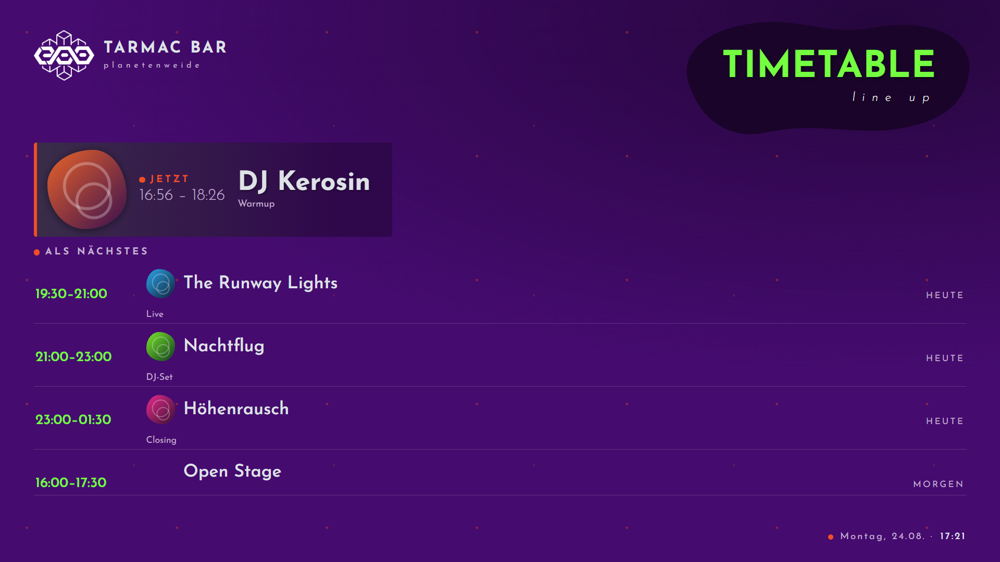

---

## Inhalt

- [Was das Programm kann](#was-das-programm-kann)
- [Einrichten an der Bar](#einrichten-an-der-bar)
- [Bedienung](#bedienung)
- [Die Anzeige](#die-anzeige)
- [Die Einstellungen](#die-einstellungen)
- [Mehrere Bars ausstatten](#mehrere-bars-ausstatten)
- [Raspberry Pi](#raspberry-pi)
- [Unterstützte Formate](#unterstützte-formate)
- [Wo die Daten liegen](#wo-die-daten-liegen)
- [Wenn etwas klemmt](#wenn-etwas-klemmt)
- [Für Entwickler](#für-entwickler)

---

## Was das Programm kann

- **Endlosschleife** aus Videos und Standbildern, startet sofort im Vollbild, immer stumm.
- **Zeitsteuerung pro Beitrag** – „immer" oder beliebig viele Zeitfenster wie
  *Fr + Sa, 20:00–02:00*. Fenster über Mitternacht funktionieren.
- **Timetable** mit Datum, Uhrzeit, Act und optionalem Foto. Die Anzeige hebt den
  laufenden Act hervor und zeigt darunter die nächsten. Vergangenes verschwindet von selbst.
- **Bildausschnitt wählbar** — pro Act festlegen, welcher Teil des Fotos zu sehen
  ist. Kein abgeschnittener Kopf mehr bei Hochformat-Bildern.
- **Getränkepreise** in Gruppen, mit Größe und Preis.
- **Spezialshot** – ein hervorgehobenes Band über die volle Breite unter den
  Preisspalten, mit eigener Überschrift, Preis und Beschreibungstext.
- **Häufigkeit einstellbar** – z. B. Timetable nach je 3 Beiträgen, Preise nach je 5.
- **Festival-Design** in Purpur, Neongrün und Signalorange, mit Josefin Sans.
  Farben, Titel, Muster und Titelfläche sind einstellbar.
- **Eigenes Logo**, mit dem L300-Logo als Standard.
- **Übergänge**: weiche Überblendung, harter Schnitt, Logo-Blende, Blob-Wisch.
- **Zweiter Monitor** – die Anzeige kann auf einem eigenen Bildschirm laufen, während
  die Einstellungen auf dem Hauptbildschirm geöffnet bleiben.
- **Jedes Bildschirmformat** – 16:9, 16:10, 4:3, Ultrawide und Hochformat.
- **Robust im Dauerbetrieb** – defekte Dateien werden übersprungen, hängende Wiedergabe
  wird erkannt, nicht abspielbare Videoformate lassen sich automatisch umwandeln.
- **Anzeige drehbar** — 90, 180 oder 270 Grad, direkt im Programm. Für hochkant
  montierte Bildschirme, ohne am Betriebssystem etwas einzustellen.
- **Durchsage** — ein Balken über die ganze Breite, vom Handy in Sekunden
  eingeblendet. Legt sich über alles, auch über laufende Videos, und blendet
  sich auf Wunsch nach 5 bis 60 Minuten von allein wieder aus.
- **Geplante Durchsagen** — Wochentage und Zeitfenster wie bei den Videos, also
  z. B. *Fr + Sa, 01:40–02:00*. Erscheinen und verschwinden von allein, jeden
  Festivaltag aufs Neue.
- **Countdown im Balken** — mit `{zeit}` im Text läuft eine Uhr mit, die
  sekundengenau auf das Ende des Fensters herunterzählt: „Letzte Runde – die Bar
  schließt in 11:30"
- **Ruhezeit** — außerhalb der Öffnungszeiten bleibt der Bildschirm schwarz und
  die Schleife steht still. Schont das Gerät und spart Strom.
- **QR-Code** auf dem Timetable, der auf eure Festivalseite zeigt – abschaltbar,
  ohne dass die Adresse verloren geht.
- **Uhrzeit aus dem Netz** — der Raspberry Pi stellt seine Uhr gegen einen
  Zeitserver. Klappt das nicht, sagt das Programm Bescheid, statt stillschweigend
  mit der falschen Zeit zu arbeiten.
- **Sparmodus** für schwache Geräte — ein Schalter statt drei Einstellungen.
- **Dateien vom Handy** — Clips, Fotos, Logo und Schrift lassen sich am
  Raspberry Pi direkt über die Bedienseite hochladen, ohne Rechner.
- **PIN für die Bedienseite** — im Netzwerk darf nur ändern, wer sie kennt.

---

## Einrichten an der Bar

Es gibt das Programm für Windows, Linux und macOS. Alle Fassungen sind funktionsgleich.
Die aktuellen Dateien liegen unter
[Releases](https://github.com/Tarmac-Festival/bar-display/releases/latest); `VERSION`
steht unten für die Versionsnummer des Releases, also z. B. `1.2.0`.

| System | Datei | Anmerkung |
|---|---|---|
| Windows | `Bar Display Setup VERSION.exe` | Installer mit Startmenü- und Desktop-Eintrag |
| Windows | `BarDisplay-portable-VERSION.exe` | ohne Installation, einfach in einen Ordner legen |
| Linux | `BarDisplay-VERSION-x86_64.AppImage` | ohne Installation, läuft auf jeder Distribution |
| Linux | `bar-display_VERSION_amd64.deb` | für Debian, Ubuntu, Mint und Verwandte |
| Linux | `bar-display-VERSION.tar.gz` | einfaches Archiv, falls die anderen beiden nicht passen |
| macOS | `BarDisplay-VERSION-arm64.dmg` | Apple Silicon (M1 und neuer) |
| macOS | `BarDisplay-VERSION-x64.dmg` | Intel-Macs |
| alle | `SHA256SUMS-windows.txt`, `-linux.txt`, `-mac.txt` | Prüfsummen, siehe [Reproduzierbare Releases](#reproduzierbare-releases) |

Raspberry Pi braucht keinen Download, siehe [Raspberry Pi](#raspberry-pi).

### Windows

Installer ausführen oder die portable `.exe` in einen Ordner legen und starten.

### Linux

AppImage einmalig ausführbar machen und starten:

```bash
chmod +x BarDisplay-*-x86_64.AppImage && ./BarDisplay-*-x86_64.AppImage
```

Oder das Debian-Paket installieren:

```bash
sudo apt install ./bar-display_*_amd64.deb
```

Beim `tar.gz` müssen Programm und ffmpeg von Hand ausführbar gemacht werden, weil das
Archiv unter Windows gepackt wurde und dabei keine Dateirechte mitkommen:

```bash
tar -xzf bar-display-*.tar.gz && chmod +x bar-display-*/bar-display bar-display-*/resources/ffmpeg/ffmpeg
```

### macOS

Das passende `.dmg` öffnen und das Programm in den Programme-Ordner ziehen.

Beim ersten Start meldet macOS, das Programm stamme von einem unbekannten
Entwickler oder sei beschädigt. Das liegt daran, dass es **nicht signiert** ist —
dafür bräuchte es ein kostenpflichtiges Apple-Entwicklerkonto. Einmalig umgehen:

Rechtsklick auf **Bar Display** im Programme-Ordner → **Öffnen** → im Dialog
nochmal **Öffnen**. Danach startet es künftig normal per Doppelklick.

Falls macOS es ganz verweigert („ist beschädigt und kann nicht geöffnet werden"),
hilft das Entfernen der Quarantäne-Markierung:

```bash
xattr -dr com.apple.quarantine "/Applications/Bar Display.app"
```

### Danach überall gleich

1. Programm starten. Es geht sofort im Vollbild auf.
2. **ESC** drücken, um in die Einstellungen zu kommen.
3. Unter *System* den Haken bei **Automatisch mit dem System starten** setzen.
4. Unter *Videos* die Clips und Plakate hinzufügen, unter *Timetable* das Programm
   eintragen, unter *Getränkepreise* die Karte pflegen.
5. **Speichern** – die Anzeige übernimmt die Änderungen sofort.

> Der Bar-PC braucht kein Node.js und keine Internetverbindung. Alles Nötige – auch die
> Schrift und ffmpeg – steckt im Programm.

---

## Bedienung

| Aktion | Wie |
|---|---|
| Einstellungen öffnen | **ESC**, oder Maus bewegen und oben rechts aufs Zahnrad klicken |
| Einstellungen (Notausgang) | **Strg + Alt + S** |
| Programm beenden | **Strg + Alt + Q**, oder in den Einstellungen unter *System* |
| Zurück zur Anzeige | Einstellungsfenster schließen |
| Speichern | Knopf oben rechts, oder **Strg + S** |

Ist unter *System* eine PIN hinterlegt, fragt die Anzeige vorher nach einem Zahlencode.
Das verhindert, dass jemand im Vorbeigehen die Preise ändert.

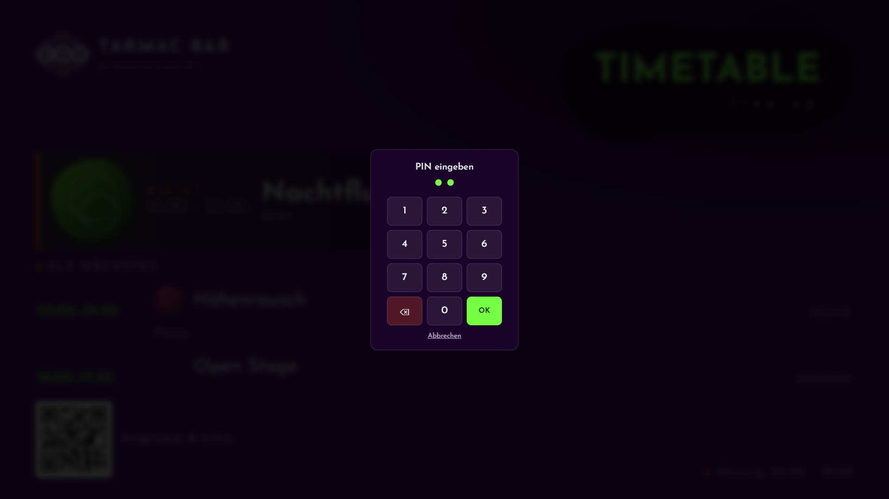

---

## Die Anzeige

### Timetable

Der gerade laufende Act steht als **JETZT**-Karte oben, mit großem Foto, Zeitspanne und
Zusatz wie „Live" oder „DJ-Set". Darunter folgen die nächsten Acts mit Miniaturfoto und
der Angabe HEUTE / MORGEN / Wochentag. Die Anzeige aktualisiert sich im laufenden Betrieb,
ohne dass jemand etwas anfassen muss.


### Getränkepreise

Die Gruppen stehen nebeneinander, die Anzahl der Spalten richtet sich nach dem Platz.
Passt die Karte nicht auf den Bildschirm, verkleinert sich die Schrift automatisch,
bis alles zu sehen ist – abgeschnitten wird nie.

Darunter liegt optional der **Spezialshot**: ein Band über die volle Breite in der
Signalfarbe, mit Überschrift, Name, Preis und einem Beschreibungstext. Gedacht für den
Shot des Abends oder eine Aktion, die nicht in der normalen Karte untergehen soll.

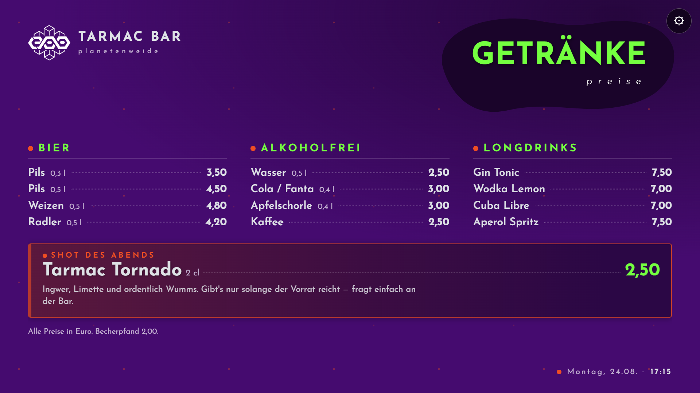

### Standbilder

Plakate laufen gleichberechtigt mit den Videos in der Schleife, formatfüllend und mit
eigener Standzeit.

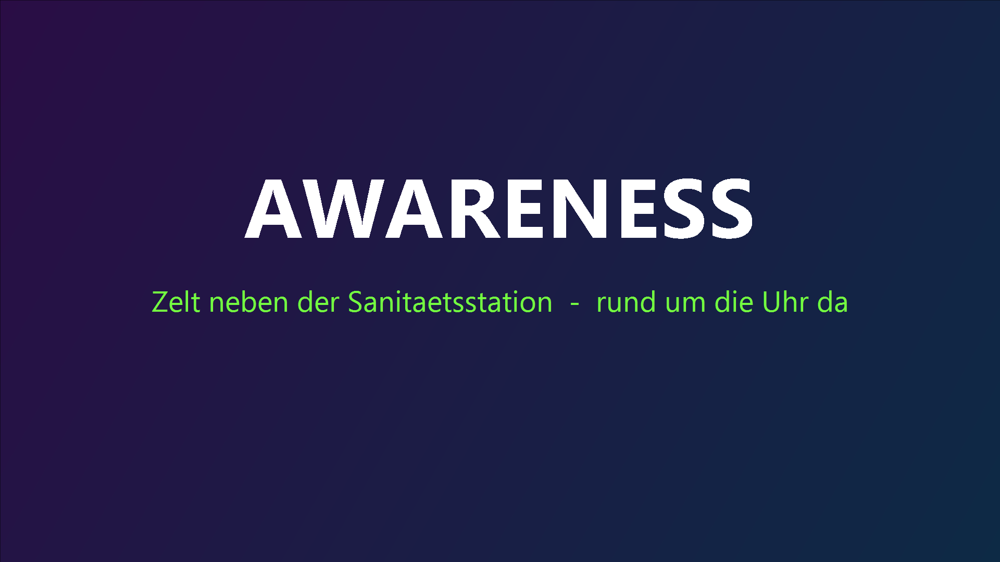

### Durchsage

Ein Balken am unteren Bildrand, über alles gelegt — auch über ein laufendes Video.
Es gibt ihn auf zwei Wegen:

**Von Hand**, wenn gerade etwas ansteht. Text eintippen, *Jetzt anzeigen* — der
Balken steht binnen einer Sekunde auf jedem Bildschirm, der an derselben
Konfiguration hängt, und blendet sich auf Wunsch nach 5 bis 60 Minuten von allein
wieder aus.

**Nach Plan**, für alles, was sich jeden Abend wiederholt. Wochentage und
Zeitfenster wie bei den Videos, auch über Mitternacht hinweg. Der Balken erscheint
und verschwindet von allein; niemand muss daran denken.


#### Countdown

Steht `{zeit}` im Text, läuft an dieser Stelle eine Uhr mit, die sekundengenau auf
das **Ende des Zeitfensters** herunterzählt. Aus

    Letzte Runde – die Bar schließt in {zeit}

bei einem Fenster von 01:40 bis 02:00 wird also um 01:48:30 auf dem Bildschirm

    Letzte Runde – die Bar schließt in 11:30

Bei null verschwindet der Balken — das Fensterende ist zugleich das Ende der
Anzeige. Über einer Stunde steht dort `1:05:00`, darunter `mm:ss`. Die Ziffern
haben feste Breite, damit der Text bei jedem Sekundenwechsel ruhig stehen bleibt.

Wer den Platzhalter vergisst, verliert nichts: die Zeit hängt sich dann hinten an
den Text. Wer gar keinen Countdown will, nimmt in der jeweiligen Durchsage den
Haken *Countdown mitlaufen lassen* weg — der Platzhalter fällt dann aus dem Text.

Eine von Hand ausgelöste Durchsage hat immer Vorrang vor dem Plan. Passen mehrere
Pläne gleichzeitig, gilt der oberste in der Liste.

### QR-Code

Unten links auf dem Timetable kann ein QR-Code mit Beschriftung stehen — z. B. auf
die Festivalseite oder auf das ausführliche Line-up. Umlaute in der Adresse sind kein
Problem.

Der Code ist **optional**: unter *Anzeige → Beschriftung* gibt es den Haken
**QR-Code auf dem Timetable anzeigen**. Ohne Haken bleibt der Timetable frei, Adresse
und Beschriftung bleiben aber gespeichert — praktisch, wenn eine Bar den Code haben
will und die nächste nicht, oder wenn er nur an einzelnen Tagen erscheinen soll.
Ohne Adresse erscheint ebenfalls kein Code.

### Ruhezeit

Außerhalb der eingestellten Öffnungszeit bleibt der Bildschirm schwarz und die
Schleife steht still — das schont Gerät und Strom. Bewegt jemand die Maus,
erscheint kurz ein Hinweis, dass das Programm läuft und nur schläft; über die
Einstellungen kommt man weiterhin ganz normal rein.

### Gedrehte Anzeige

Für senkrecht aufgehängte Fernseher lässt sich die ganze Anzeige um 90, 180 oder
270 Grad drehen, samt Übergängen und PIN-Feld. Am Betriebssystem muss dafür nichts
eingestellt werden — praktisch besonders am Raspberry Pi.

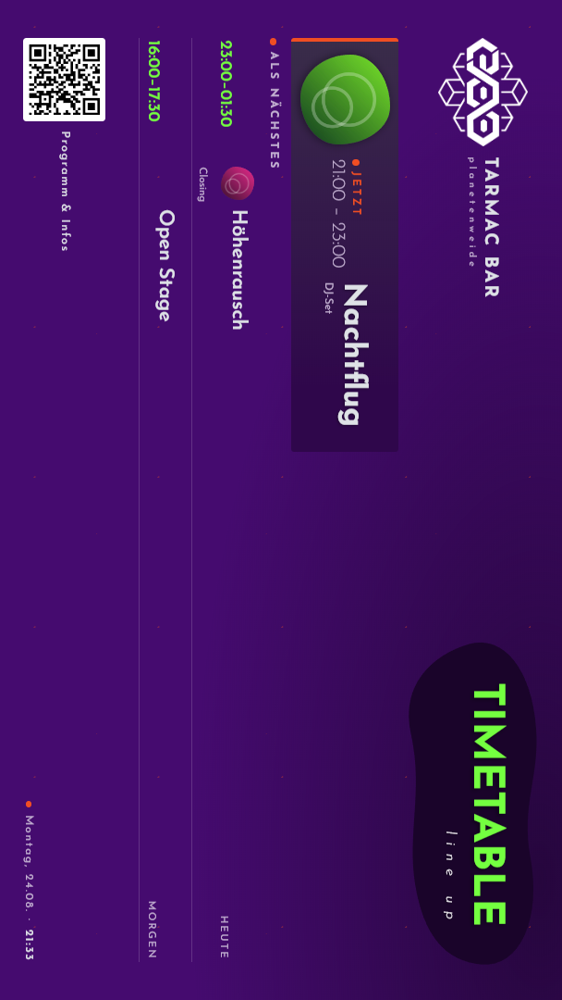

### Wenn die Uhr nicht steht

Läuft die Systemuhr nicht gegen einen Zeitserver, färbt sich die Uhrzeit unten
rechts orange und bekommt ein Warndreieck. Absichtlich klein — Gäste sollen keine
Fehlermeldung sehen, das Barpersonal aber merken, dass etwas nicht stimmt. Im
Klartext steht es unter *System → Uhrzeit*.


Warum das wichtig ist: **Timetable, Zeitfenster der Clips, Ruhezeit und geplante
Durchsagen hängen alle an der Systemuhr.** Ein Raspberry Pi hat keine
batteriegepufferte Uhr und startet ohne Netz mit der Zeit des letzten
Herunterfahrens — das sieht völlig plausibel aus und ist trotzdem falsch. Mehr
dazu unter [Raspberry Pi](#raspberry-pi).

### Übergänge

Vier Varianten, einstellbar unter *Anzeige → Stil & Übergänge*:

| Übergang | Beschreibung |
|---|---|
| Weiche Überblendung | Beitrag blendet in den nächsten über (Standard) |
| Harter Schnitt | Ohne Überblendung |
| Logo-Blende | Eine Fläche mit dem Logo zieht auf und wieder weg |
| Blob-Wisch | Eine organische Form fährt mit dem Logo durchs Bild |

Ohne hinterlegtes Logo erscheint bei beiden Logo-Varianten der Bar-Name.

| Logo-Blende | Blob-Wisch |
|---|---|
| 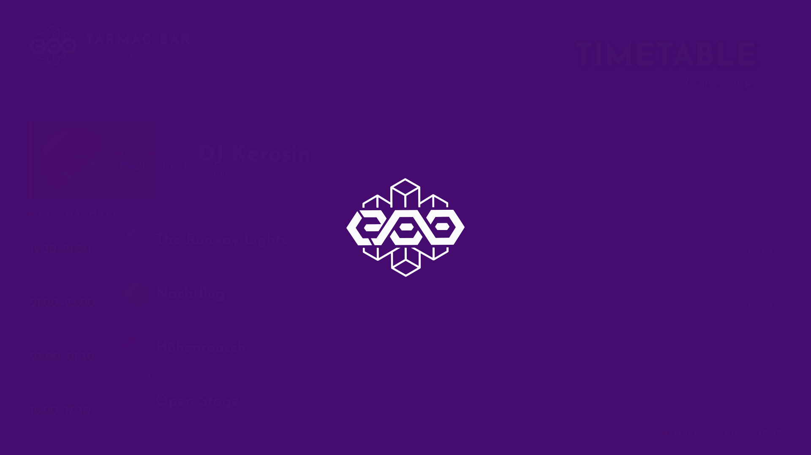 | 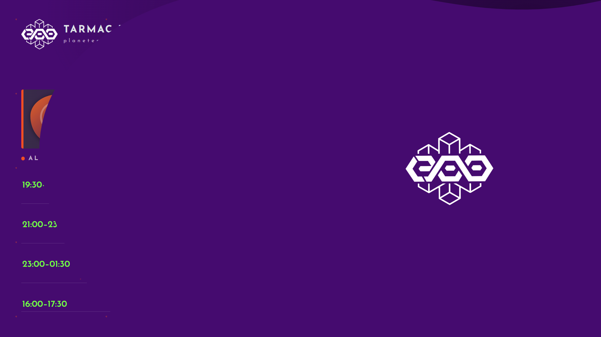 |

---

## Die Einstellungen

Die Reiter stehen nach Häufigkeit: **Durchsage, Timetable, Getränkepreise,
Videos, Anzeige, System.** Vorn steht, was jeden Abend angefasst wird; hinten,
was einmal beim Aufbau eingestellt wird. Beim Öffnen ist *Durchsage* aktiv —
am Rechner wie am Handy.

### Durchsage

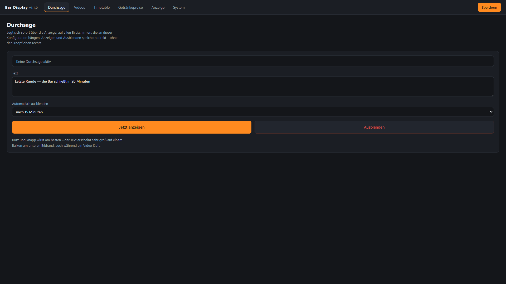

Der erste Reiter — dafür kommt man meistens her.
Text eintippen, **Jetzt anzeigen** — der Balken steht binnen einer Sekunde auf
allen Bildschirmen, die an derselben Konfiguration hängen. **Ausblenden** nimmt
ihn wieder weg. Beide Knöpfe speichern sofort, ohne den Speichern-Knopf oben.

Optional blendet sich die Durchsage nach 5, 15, 30 oder 60 Minuten von allein
aus — praktisch für „Letzte Runde", damit niemand daran denken muss.

Im Browserbetrieb steht auf demselben Reiter eine **Vorschau**: so sehen
Timetable und Preise gerade aus, ohne zum Bildschirm zu laufen. Videos werden
darin weggelassen, damit die Vorschau den Pi nicht zusätzlich belastet.

Darunter liegen die **geplanten Durchsagen**.

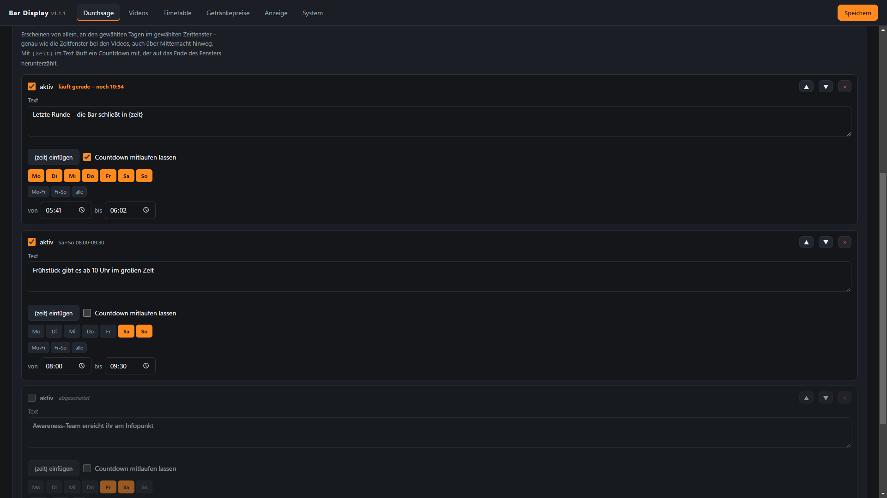

Pro Eintrag: Text, Wochentage, Von–Bis und zwei Haken.

- **aktiv** schaltet einen Eintrag vorübergehend ab, ohne ihn zu löschen.
- **{zeit} einfügen** setzt den Platzhalter dort ein, wo der Cursor gerade steht.
- **Countdown mitlaufen lassen** bestimmt, ob die Uhr überhaupt zählt.
- Die Pfeile rechts ändern die Reihenfolge — bei gleichzeitig passenden Plänen
  gewinnt der oberste.
- Neben *aktiv* steht in Klartext, was der Eintrag gerade tut: „läuft gerade –
  noch 10:54", „Sa+So 08:00-09:30", „abgeschaltet" oder ein roter Hinweis, wenn
  Text oder Wochentag fehlen und deshalb nie etwas erscheinen würde.

**Vorlage „Bar schließt"** legt einen fertigen Eintrag mit Countdown an, bei dem
nur noch die Uhrzeiten anzupassen sind.

### Videos

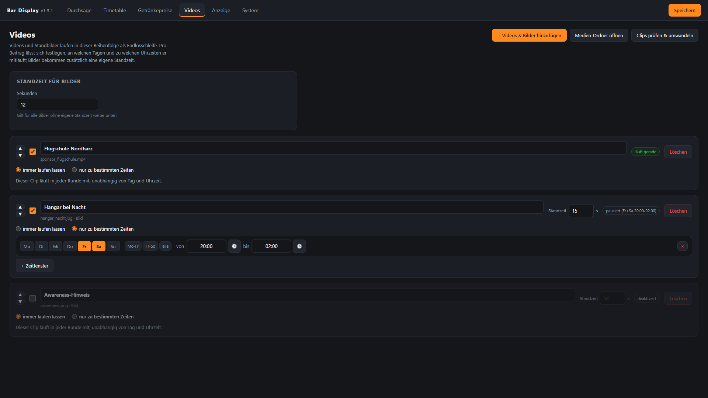

Hier steht die Schleife. Die Reihenfolge in der Liste ist die Reihenfolge auf dem
Bildschirm, verschieben geht mit den Pfeilen links.

- **+ Videos & Bilder hinzufügen** kopiert die Dateien in den Medien-Ordner des
  Programms. Die Originale können danach weg.
- Das **Häkchen** schaltet einen Beitrag vorübergehend ab, ohne ihn zu löschen.
- **immer laufen lassen** / **nur zu bestimmten Zeiten**: Bei der zweiten Wahl erscheint
  ein Zeitfenster mit Wochentagen und Uhrzeiten. Mehrere Fenster pro Beitrag sind möglich,
  die Schnellwahl *Mo-Fr*, *Fr-So* und *alle* spart Klicks.
- Bei Bildern erscheint zusätzlich ein Feld **Standzeit** in Sekunden. Bleibt es leer,
  gilt die globale Vorgabe aus dem Reiter *Anzeige*.
- Das Fähnchen rechts zeigt live an, ob der Beitrag gerade läuft, pausiert oder
  deaktiviert ist – inklusive der Zeitfenster im Klartext.
- **Clips prüfen & umwandeln** testet alle Videos und bietet an, nicht abspielbare
  Formate nach MP4 umzurechnen.

### Timetable

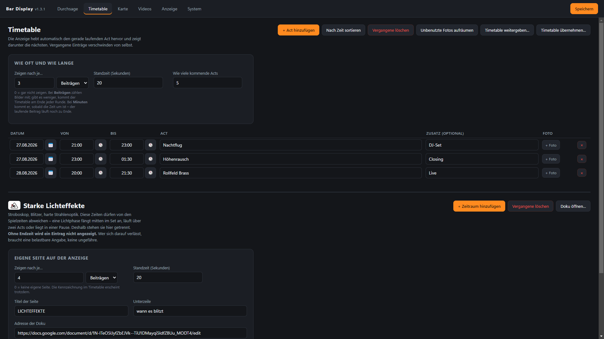

Eine Zeile pro Act: Datum, Von, Bis, Name und ein optionaler Zusatz. Der gerade laufende
Act ist in der Tabelle farbig hinterlegt, vergangene sind ausgegraut.

- **Foto**: Klick auf *+ Foto* wählt ein Bild, Klick auf die Miniatur tauscht es,
  das rote × entfernt es.
- **Ausschnitt**: der kleine Knopf unten rechts auf der Miniatur öffnet die
  Ausschnittwahl — siehe unten.
- **Nach Zeit sortieren** bringt die Liste in die richtige Reihenfolge.
- **Vergangene löschen** räumt nach dem Festival auf.
- **Unbenutzte Fotos aufräumen** löscht Bilder, die keinem Act mehr zugeordnet sind.
- **Timetable weitergeben / übernehmen**: siehe [Mehrere Bars ausstatten](#mehrere-bars-ausstatten).

Endet ein Act nach Mitternacht, einfach `23:00` bis `01:30` eintragen – das Programm
erkennt den Tageswechsel selbst.

#### Bildausschnitt wählen

Die Anzeige beschneidet Act-Fotos auf eine quadratische, organisch geformte Fläche.
Ohne Zutun sitzt der Ausschnitt mittig – bei einem Hochformat trifft das gern den
Bauch statt des Gesichts:

| mittig (Standard) | selbst gewählt |
|---|---|
| 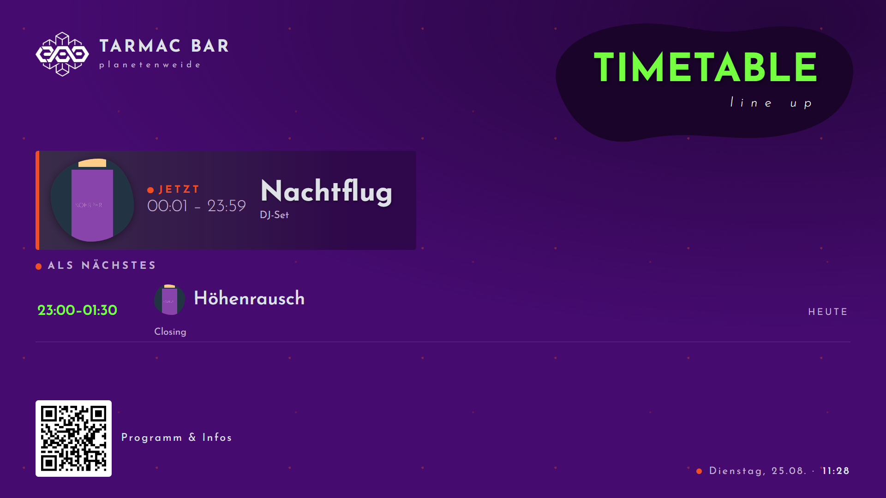 | 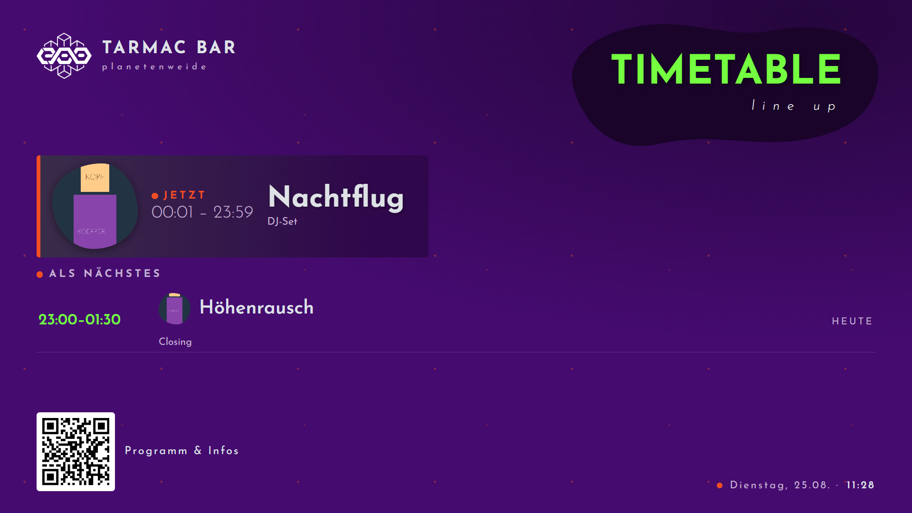 |

Der Knopf unten rechts auf der Miniatur öffnet dafür ein Fenster:

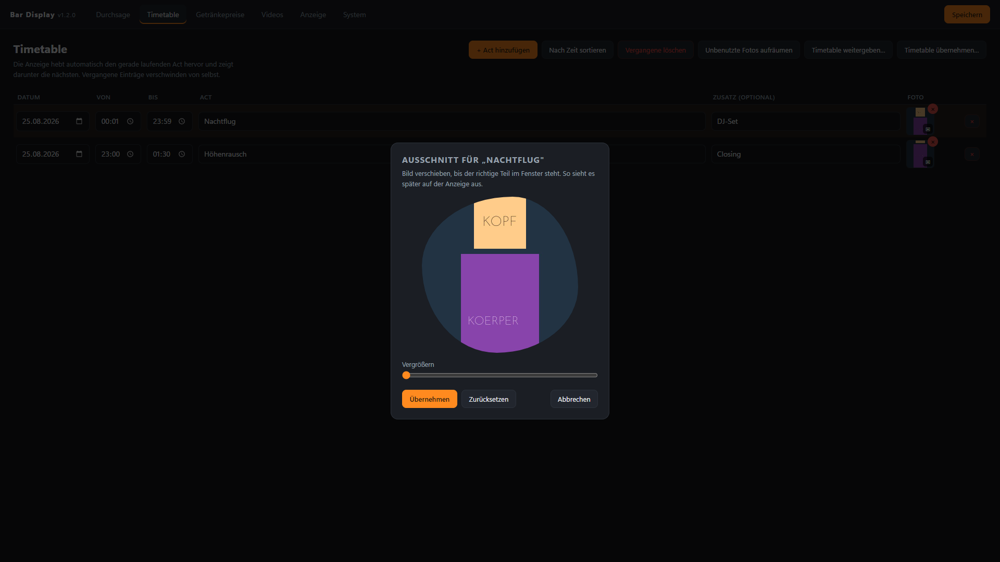

- **Bild verschieben**, bis der richtige Teil im Fenster steht — mit der Maus
  ziehen, am Handy mit dem Finger.
- **Vergrößern** holt einen kleineren Ausschnitt heran, bis zum Vierfachen.
- **Zurücksetzen** stellt wieder auf mittig.

Das Fenster hat dieselbe Form und denselben Zuschnitt wie die Anzeige — was dort
steht, steht später auch auf dem Bildschirm. Der Ausschnitt gehört zum Act, nicht
zur Bilddatei: dasselbe Foto kann bei zwei Acts unterschiedlich sitzen, und beim
*Timetable weitergeben* wandert er mit.

### Getränkepreise

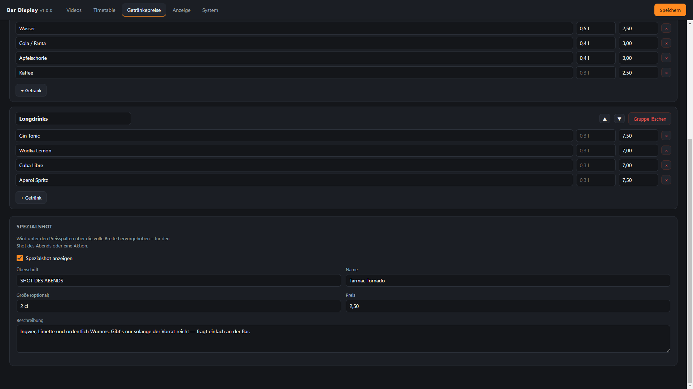

Gruppen wie *Bier*, *Alkoholfrei* oder *Longdrinks*, darin je ein Getränk pro Zeile mit
Name, Größe und Preis. Die Größe darf leer bleiben. Die Reihenfolge der Gruppen lässt
sich mit den Pfeilen ändern.

Ganz unten steht die Karte **Spezialshot**. Einmal den Haken setzen, dann Überschrift,
Name, Größe, Preis und Beschreibung eintragen – fertig. Ohne Haken erscheint das Band
gar nicht. Die Überschrift ist frei wählbar, also auch *AKTION*, *HAPPY HOUR* oder was
sonst passt.

### Anzeige

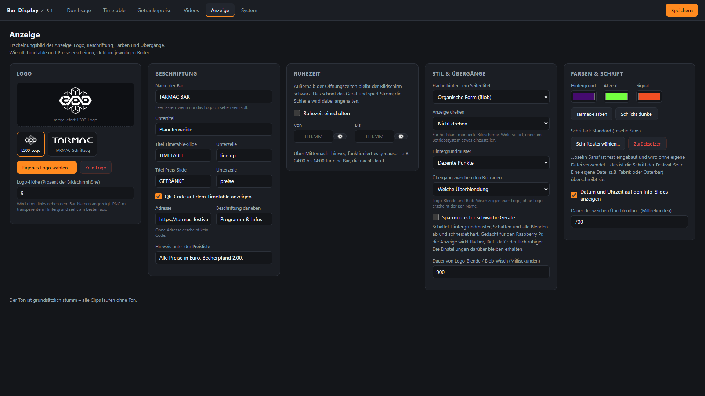

- **Info-Slides in der Schleife**: nach wie vielen Beiträgen Timetable und Preise
  erscheinen und wie lange sie stehen bleiben. `0` schaltet den jeweiligen Slide ab.
  Der Zähler läuft über die Runden hinweg weiter – „nach je 5 Beiträgen" greift also
  auch, wenn gerade nur 3 Clips aktiv sind.
- **Logo**: eigenes Logo wählen, auf das L300-Standardlogo zurücksetzen oder ganz
  abschalten. Die Höhe ist in Prozent der Bildschirmhöhe angegeben.
- **Beschriftung**: Bar-Name, Untertitel und die Titel beider Info-Slides. Lässt man den
  Bar-Namen leer, steht dort nur das Logo.
- **Stil & Übergänge**: Fläche hinter dem Seitentitel (Blob, Balken oder ohne),
  Hintergrundmuster (keins, dezente Punkte, Konfetti) und der Übergang.
- **Farben & Schrift**: Hintergrund-, Akzent- und Signalfarbe, zwei Voreinstellungen,
  optional eine eigene Schriftdatei.
- **Sparmodus**: schaltet Hintergrundmuster, Schatten, die Form hinter dem
  Seitentitel und alle Blenden ab und schneidet hart. Für den Raspberry Pi
  gedacht. Die übrigen Einstellungen bleiben gespeichert — der Schalter
  überstimmt sie nur, solange er gesetzt ist.
- **Anzeige drehen**: 90, 180 oder 270 Grad. Gedacht für senkrecht montierte
  Bildschirme — der Fernseher wird gedreht aufgehängt, die Anzeige dreht mit.
  Wirkt sofort und gilt auf jedem System gleich, auch auf dem Raspberry Pi,
  wo die Drehung über das Betriebssystem umständlich ist.
- **Ruhezeit**: Von–Bis, außerhalb dessen bleibt der Bildschirm schwarz. Über
  Mitternacht hinweg funktioniert es wie bei den Clips, also auch 04:00 bis 14:00
  für eine Bar, die nachts läuft. Unbrauchbare Zeiten schalten die Ruhezeit ab,
  statt den Bildschirm dauerhaft schwarz zu lassen.
- **QR-Code**: Haken setzen, Adresse und Beschriftung eintragen — dann erscheint
  unten links auf dem Timetable ein Code. Ohne Haken bleiben die Felder ausgegraut
  und gespeichert, es erscheint aber nichts.

### System

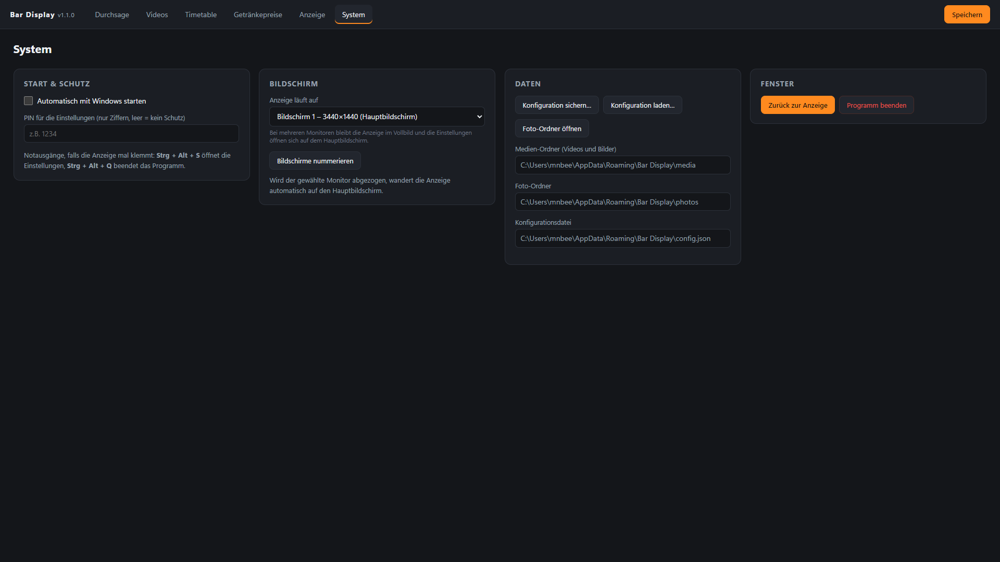

- **Automatisch mit Windows starten**
- **PIN** für die Einstellungen (nur Ziffern, leer = kein Schutz). Sie schützt
  zweierlei: das Einstellungsfenster am Bildschirm und die Bedienseite im
  Netzwerk — siehe [Raspberry Pi](#raspberry-pi).
- **Uhrzeit**: Datum, Uhrzeit und ob sie aus dem Netz abgeglichen ist. Unter
  Windows und macOS steht dort nur die Zeit — diese Systeme haben eine
  Hardware-Uhr und halten sie selbst in Ordnung. Auf einem Raspberry Pi ist das
  die wichtigste Zeile im ganzen Fenster.
- **Bildschirm**: auf welchem Monitor die Anzeige läuft. *Bildschirme nummerieren*
  blendet kurz eine große Ziffer auf jedem Schirm ein, damit die Zuordnung klar ist.
  Wird der gewählte Monitor abgezogen, wandert die Anzeige auf den Hauptbildschirm.
- **Konfiguration sichern / laden** als JSON-Datei
- **Programm beenden**

---

## Mehrere Bars ausstatten

**Einmal komplett einrichten, dann verteilen:**

1. An einem Rechner alles einstellen: Logo, Farben, Timetable, Preise.
2. *System → Konfiguration sichern* schreibt alles in eine JSON-Datei.
3. An der nächsten Bar dieselbe `.exe` installieren, die Datei über
   *Konfiguration laden* einspielen, dann nur noch Bar-Name und Preise anpassen.

**Line-up nachträglich ändern:**

*Timetable → Timetable weitergeben* schreibt eine einzelne Datei, in der die Acts
**samt Fotos** eingebettet sind. An den anderen Bars *Timetable übernehmen* – Preise und
Videos der jeweiligen Bar bleiben unangetastet. Damit lassen sich Programmänderungen
durchreichen, ohne dass an den einzelnen Bars etwas kaputtgeht.

Videodateien wandern nicht mit; die kommen per USB-Stick in den Medien-Ordner oder werden
an jeder Bar über *Videos & Bilder hinzufügen* eingelesen.

---

## Raspberry Pi

Auf einem Raspberry Pi läuft **nicht** die Electron-Fassung. Electron bringt sein
eigenes Chromium mit, und das nutzt die Hardware-Dekodierung des Pi nicht — 1080p
wäre damit auf einem Pi 3 unbrauchbar. Stattdessen läuft dort ein kleiner Dienst,
der dieselbe Anzeige ausliefert, und das Chromium von Raspberry Pi OS zeigt sie an.
**Die Anzeige selbst ist Zeile für Zeile dieselbe** — Design, Schleife, Zeitfenster,
Timetable, Spezialshot, alles identisch.

### Einrichten

Raspberry Pi OS flashen, ins Terminal, ein Befehl:

```bash
curl -fsSL https://raw.githubusercontent.com/Tarmac-Festival/bar-display/main/pi/install.sh | bash
```

Das Skript installiert Node.js, Chromium und `cage`, legt das Programm nach
`/opt/bar-display` und richtet zwei Dienste ein: einen für den Webdienst, einen für
die Vollbildanzeige. Nach dem Neustart läuft alles von allein.

### Bedienung vom Handy

Am Pi gibt es keine Tastatur. Die Einstellungen laufen deshalb über das Netzwerk —
im selben WLAN im Browser aufrufen:

```
http://<IP-des-Pi>:8080/einstellungen
```

Die Seite ist für schmale Bildschirme ausgelegt. Änderungen erscheinen **sofort** auf
der Anzeige, ohne Neustart. Timetable, Preise, Spezialshot, Durchsagen, alle Texte,
Farben, Häufigkeiten und Zeitfenster lassen sich dort ändern.

### Dateien vom Handy hochladen

Clips, Standbilder, Act-Fotos, das Logo und eine eigene Schrift könnt ihr direkt
vom Handy hochladen — dieselben Knöpfe wie am Rechner, nur öffnet sich statt eines
Systemdialogs die Dateiauswahl des Telefons.

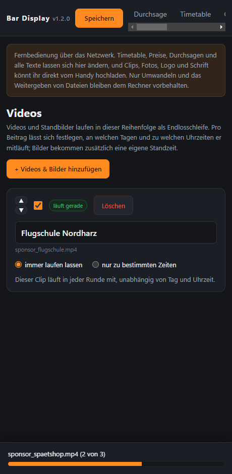

Ein Balken am unteren Rand zeigt den Fortschritt; über WLAN dauert ein Video seine
Zeit. **Fotos werden vor dem Hochladen im Browser verkleinert** — aus einem
6-MB-Handyfoto werden rund 260 KB. Act-Fotos landen auf der Anzeige ohnehin
quadratisch beschnitten bei wenigen hundert Pixeln, es geht also nichts verloren.
Welcher Teil des Fotos das ist, lässt sich pro Act wählen — auch am Handy.

Zwei Dinge, die man wissen sollte:

**iPhone-Videos spielen auf einem Pi meist nicht.** iPhones nehmen standardmäßig in
HEVC (H.265) auf, und ein Pi 3B kann das nicht dekodieren — auch nicht langsam. Das
Programm erkennt das direkt nach dem Hochladen und sagt es, statt den Clip abends
stillschweigend zu überspringen. Abhilfe: am iPhone unter *Einstellungen → Kamera →
Formate* auf **Maximale Kompatibilität** stellen, oder den Clip am Rechner nach MP4
umwandeln.

**Umwandeln geht am Handy nicht.** Dafür fehlt dem Pi ffmpeg, und ein Pi 3B wäre
damit auch viele Minuten beschäftigt. Das bleibt dem Rechner vorbehalten.

Wer lieber am Rechner arbeitet, kann Dateien weiterhin einfach in die Ordner auf dem
Pi kopieren:

```
~/.config/Bar Display/media      Videos und Standbilder
~/.config/Bar Display/photos     Act-Fotos
~/.config/Bar Display/branding   eigenes Logo
```

Praktisch: Die Konfigurationsdatei hat auf allen Systemen dasselbe Format. Ihr könnt
also am Rechner alles einrichten und `config.json` samt Ordnern auf den Pi kopieren.

### PIN für die Bedienseite

Die Bedienseite ist über das Netzwerk erreichbar, und seit sich darüber Dateien
hochladen lassen, gehört sie geschützt. Ist unter *System* eine PIN hinterlegt, fragt
die Seite beim Öffnen danach.

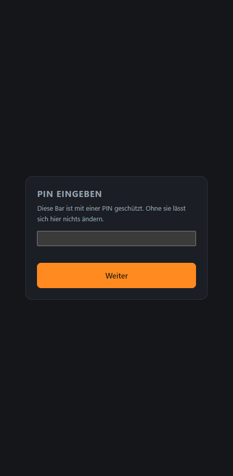

- **Lesen bleibt offen.** Die Anzeige selbst holt sich ihre Konfiguration über
  dieselbe Schnittstelle und kann keine PIN eintippen.
- **Ändern, Hochladen und Löschen verlangen die PIN.**
- Die PIN steht zwar in der Konfiguration, wird aber nur an angemeldete Geräte
  ausgeliefert — aus der offen lesbaren Fassung lässt sie sich nicht ablesen.
- Die Anmeldung gilt einen Festivaltag lang und überlebt keinen Neustart des
  Dienstes. Wird die PIN geändert, müssen sich alle neu anmelden.

Ohne PIN bleibt alles wie bisher: jeder im selben WLAN darf ändern. Für eine Bar im
abgeschlossenen Backstage-Netz ist das in Ordnung — im offenen Gäste-WLAN eher nicht.

### Die Uhr

Ein Raspberry Pi hat **keine batteriegepufferte Uhr**. Ohne Abgleich aus dem Netz
startet er mit der Zeit des letzten Herunterfahrens. Das sieht plausibel aus und
ist trotzdem falsch — und daran hängt alles: Timetable, Zeitfenster der Clips,
Ruhezeit und die geplanten Durchsagen greifen dann zur falschen Stunde, ohne dass
irgendwo eine Fehlermeldung erscheint.

Das Installationsskript richtet deshalb ein:

- **systemd-timesyncd** holt die Zeit von `pool.ntp.org`, mit
  `time.cloudflare.com` und `time.google.com` als Rückfall.
- Zusätzlich wird **der eigene WLAN-Router** als Zeitquelle eingetragen. Auf einem
  Flugplatz ohne Internet beantwortet der oft die Zeitanfrage — immer noch besser
  als gar kein Abgleich.
- **fake-hwclock** merkt sich die Zeit beim Herunterfahren, damit der Pi nach
  einem Stromausfall wenigstens nicht im Jahr 1970 landet.

Nach der Einrichtung sagt das Skript, ob der Abgleich durchgekommen ist. Später
prüfen:

```bash
timedatectl status
```

Der Dienst startet absichtlich auch **ohne** geglückten Zeitabgleich — eine
laufende Anzeige mit Warnhinweis ist besser als ein schwarzer Bildschirm. Der
Hinweis erscheint dann klein auf der Anzeige und im Klartext unter
*System → Uhrzeit*.

> Ohne jeden Netzzugang kann sich der Pi die Zeit nirgends holen. Dann bleibt nur,
> sie einmalig von Hand zu stellen: `sudo date -s "2026-08-28 17:30"` — und danach
> den Pi nicht vom Strom zu nehmen.

### Was der Pi leisten muss

| | |
|---|---|
| Getestet gedacht für | Pi 3B mit 1 GB |
| Videos | H.264 in MP4, Hardware-Dekodierung über Chromium |
| Nicht empfohlen | Pi Zero 2 W — 512 MB sind für Chromium zu knapp |

Nützliche Befehle auf dem Pi:

```bash
bar-display-update
```

```bash
journalctl -u bar-display-kiosk -f
```

### Wenn es ruckelt

**Der Sparmodus zuerst.** Unter *Anzeige → Sparmodus* fällt alles weg, was die
Grafikeinheit des Pi pro Bild erneut beschäftigt: das gekachelte Punktmuster,
sämtliche Schatten, die Maske hinter dem Seitentitel, die Weichzeichner der
Bedienflächen — und statt zu blenden wird hart geschnitten. Die Anzeige wirkt
flacher, läuft dafür deutlich ruhiger.

| Normal | Sparmodus |
|---|---|
| 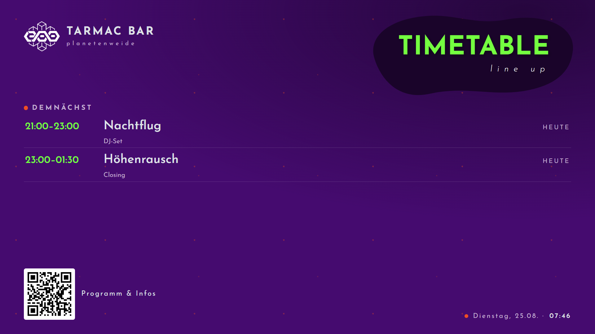 | 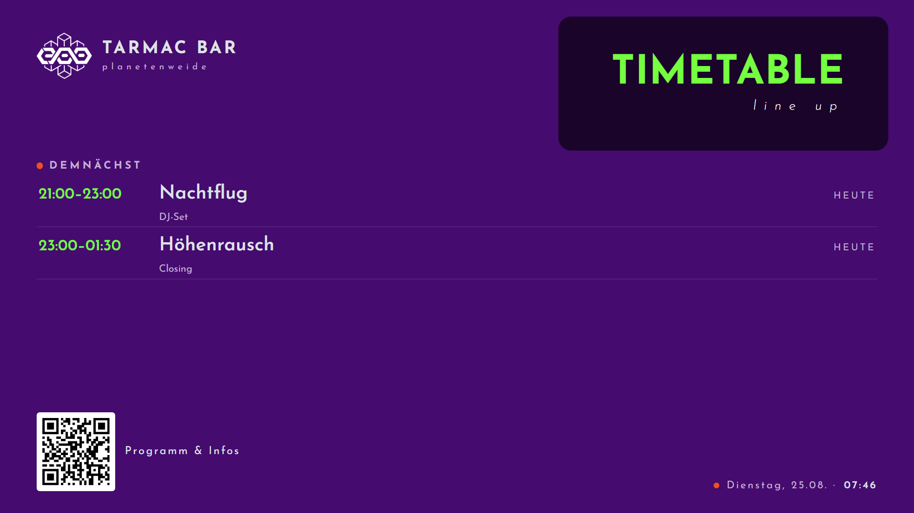 |

**Videos auf 720p herunterrechnen.** Ein Pi 3B dekodiert 1080p nur mit
Hardwareunterstützung flüssig, und die greift nicht bei jedem Format.

**Läuft die Dekodierung überhaupt in Hardware?** In Chromium auf dem Pi die
Adresse `chrome://gpu` öffnen und die Zeile *Video Decode* lesen. Steht dort
Software, hilft das Herunterrechnen am meisten.

Das Installationsskript nimmt außerdem folgende Einstellungen vor:

- **`gpu_mem=128`** in der `config.txt`. Ohne genug Speicher für die
  Grafikeinheit fällt der Pi bei 1080p auf den Hauptprozessor zurück.
- **Chromium sparsam gestartet** — ein Renderprozess, Sparmodus für schwache
  Geräte, kein Crash-Reporter, kein Komponenten-Update, kein Hintergrundfunk.
- **Zwischenspeicher im RAM** statt auf der SD-Karte. Die Karte ist im
  Dauerbetrieb das schwächste Glied; je weniger darauf geschrieben wird, desto
  länger hält sie. Aus demselben Grund landen auch die Protokolle im RAM.
- **WLAN-Stromsparen aus.** Sonst verzögert der Treiber die Push-Verbindung zur
  Bedienseite, und Durchsagen vom Handy kämen mit Verspätung an.

### Ehrlicher Hinweis

Der Dienst, die Anzeige im Browser, die Bedienseite und das Live-Nachladen sind
geprüft — allerdings auf einem PC, nicht auf einem Pi. Ob 1080p auf einem Pi 3B
wirklich flüssig läuft und ob der Speicher reicht, lässt sich nur am Gerät
feststellen. Wenn es klemmt, sind das die wahrscheinlichsten Stellschrauben:
Videos auf 720p herunterrechnen und den Sparmodus einschalten. Auch die
Chromium-Startoptionen und `gpu_mem` sind nach bestem Wissen gesetzt, aber nicht
am Gerät nachgemessen — ob die Videodekodierung wirklich in Hardware läuft,
sieht nur jemand vor dem Pi über `chrome://gpu`.


## Unterstützte Formate

| Art | Formate |
|---|---|
| Video, direkt abspielbar | MP4 (H.264), WebM, OGV |
| Video, per Umwandlung | AVI, WMV, MKV, MOV, HEVC, ProRes und weitere |
| Bilder in der Schleife | JPG, PNG, WebP, GIF, AVIF, BMP |
| Act-Fotos | JPG, PNG, WebP, GIF, AVIF, BMP |
| Logo | PNG, SVG, JPG, WebP |
| Schrift | TTF, OTF, WOFF, WOFF2 |

Beim Hinzufügen prüft das Programm jedes Video und bietet die Umwandlung nach MP4 an,
wenn Windows es nicht direkt abspielen kann. Dafür ist ffmpeg mitgeliefert.

Act-Fotos werden quadratisch beschnitten, standardmäßig mittig. Passt das nicht,
lässt sich der Ausschnitt pro Act selbst wählen – siehe
[Bildausschnitt wählen](#bildausschnitt-wählen). Ab ungefähr 400 px Kantenlänge
sieht es gut aus; größer schadet nicht, das Programm verkleinert beim Hochladen
vom Handy ohnehin.

---

## Wo die Daten liegen

Unter Windows liegt alles in `%APPDATA%\Bar Display\`, unter Linux in
`~/.config/Bar Display/`, unter macOS in `~/Library/Application Support/Bar Display/`.

| Was | Datei bzw. Ordner |
|---|---|
| Einstellungen | `config.json` |
| Sicherungskopie | `config.backup.json` |
| Videos und Bilder | `media/` |
| Act-Fotos | `photos/` |
| Eigenes Logo | `branding/` |
| Eigene Schrift | `fonts/` |

Vor jedem Speichern legt das Programm eine Sicherungskopie der letzten Fassung an.

Der Autostart wird unter Windows im Anmelde-Autostart eingetragen, unter Linux als
`~/.config/autostart/bar-display.desktop`.

---

## Wenn etwas klemmt

| Problem | Lösung |
|---|---|
| Bildschirm bleibt schwarz | **Strg + Alt + S** öffnet die Einstellungen auch dann, wenn die Anzeige nicht reagiert |
| Ein Clip wird übersprungen | Format wird nicht unterstützt – *Videos → Clips prüfen & umwandeln* |
| Anzeige auf dem falschen Monitor | *System → Bildschirm*, vorher *Bildschirme nummerieren* |
| Preise/Timetable erscheinen nie | Im Reiter *Anzeige* steht die Häufigkeit auf `0` |
| Ein Clip läuft nie | Fähnchen im Reiter *Videos* prüfen: deaktiviert oder kein Zeitfenster gesetzt |
| Nach einem System-Update startet nichts mehr | Autostart unter *System* neu setzen |
| Bildschirm schwarz, Maus zeigt einen Hinweis | Ruhezeit ist aktiv – *Anzeige → Ruhezeit* |
| Durchsage hängt fest | *Durchsage → Ausblenden*, oder eine Ausblendzeit setzen |
| Geplante Durchsage erscheint nie | Status neben *aktiv* lesen: fehlt Text oder Wochentag? |
| Countdown zählt nicht | `{zeit}` im Text und Haken bei *Countdown mitlaufen lassen* |
| Falsche Durchsage auf dem Schirm | Eine von Hand ausgelöste hat Vorrang – erst *Ausblenden* |
| Uhrzeit orange mit Warndreieck | Zeitabgleich fehlt – *System → Uhrzeit*, am Pi `timedatectl status` |
| Timetable zeigt den falschen Act | Erst die Uhrzeit prüfen, danach die Einträge |
| Act-Foto zeigt den falschen Bildteil | Knopf unten rechts auf der Miniatur, Ausschnitt zurechtziehen |
| Anzeige ruckelt auf dem Pi | *Anzeige → Sparmodus*, danach Videos auf 720p |
| Hochgeladener Clip wird übersprungen | Meist HEVC vom iPhone – Meldung nach dem Hochladen beachten |
| Bedienseite fragt nach einer PIN | Steht unter *System → PIN*; wer sie nicht hat, darf nur zusehen |
| Hochladen bricht ab | Zu groß, zu wenig Platz oder WLAN weg – die Meldung nennt den Grund |
| Anzeige steht auf dem Kopf oder quer | *Anzeige → Anzeige drehen* auf „Nicht drehen" |
| QR-Code fehlt auf dem Timetable | *Anzeige → Beschriftung*: Haken setzen und Adresse eintragen |
| macOS: „unbekannter Entwickler" oder „beschädigt" | Rechtsklick → Öffnen, siehe Abschnitt macOS. Das Programm ist unsigniert, nicht kaputt |
| Linux: Programm startet nicht | Ausführbar-Bit fehlt – `chmod +x` auf die AppImage bzw. auf `bar-display` und `resources/ffmpeg/ffmpeg` |
| Linux: Umwandlung nicht verfügbar | Sollte nicht vorkommen, ffmpeg liegt bei. Notfalls `sudo apt install ffmpeg` – das Programm nimmt auch ein systemweit installiertes |

---

## Für Entwickler

Node.js wird nur zum Bauen gebraucht, nicht auf dem Bar-PC.

```bash
npm install
```

Zum Testen starten:

```bash
npm start
```

Tests für die Zeitfenster- und Timetable-Logik:

```bash
npm test
```

Pakete bauen – die Ergebnisse landen in `dist/`:

```bash
npm run dist
```

```bash
npm run dist:linux
```

```bash
npm run dist:mac
```

Beim ersten Bauen holt das Projekt die ffmpeg-Binärdateien für alle Plattformen nach
`vendor/` (absichtlich nicht im Repository). Jeder Download wird gegen eine hinterlegte
SHA-256-Prüfsumme geprüft. Einzeln anstoßen:

```bash
npm run vendor:ffmpeg
```

Jede Plattform baut nur auf sich selbst: **AppImage und `.deb` brauchen Linux, `.dmg`
braucht macOS.** Deshalb baut der Ablauf auf GitHub alle drei parallel.

**AppImage und `.deb` lassen sich nur auf einem Linux-System bauen** – electron-builder
braucht dafür Linux-Werkzeuge. Unter Windows entsteht nur ein `tar.gz`, dem außerdem die
Ausführungsrechte fehlen. Der bequeme Weg ist der Ablauf in
`.github/workflows/release.yml`: einen Tag anlegen und schieben, dann baut GitHub alle
Pakete für Windows und Linux und hängt sie an das Release.

```bash
git tag v1.2.0 && git push origin v1.2.0
```

### Reproduzierbare Releases

Damit ein Release später aus demselben Stand nochmal gebaut werden kann:

- **Abhängigkeiten sind festgenagelt.** `package-lock.json` liegt im Repository, der
  Ablauf auf GitHub benutzt `npm ci` — nie `npm install`.
- **ffmpeg ist auf Prüfsumme festgelegt.** `scripts/fetch-ffmpeg.js` kennt für jede
  Plattform die erwartete SHA-256 und Dateigröße und bricht ab, wenn etwas nicht passt.
  Ein stillschweigend ausgetauschter Download fällt damit auf.
- **Tag und Version müssen zusammenpassen.** Der Ablauf vergleicht den Git-Tag mit der
  Version in `package.json` und bricht bei Abweichung ab, bevor irgendetwas gebaut wird.
- **Prüfsummen liegen dem Release bei.** Zu jeder Plattform gibt es eine
  `SHA256SUMS-*.txt`. Damit lässt sich eine heruntergeladene Datei gegenprüfen:

```bash
sha256sum -c SHA256SUMS-linux.txt
```

Ein Release entsteht ausschließlich über den Ablauf auf GitHub, nie von Hand:
Version in `package.json` setzen, committen, Tag anlegen und schieben.
Schlägt ein Lauf fehl, steht der Auszug aus dem Protokoll direkt in der
Zusammenfassung des Laufs.

### Aufbau

| Datei | Zweck |
|---|---|
| `main.js` | Fenster, Konfiguration, Medien-Import, Umwandlung, Bildschirmwahl, Autostart |
| `preload.js` | abgesicherte Brücke zwischen Fenster und System |
| `src/common.js` | Zeitfenster-Logik und Timetable-Berechnung, von beiden Fenstern genutzt |
| `src/player.*` | die Vollbild-Anzeige: Schleife, Übergänge, Slides |
| `src/settings.*` | das Einstellungsfenster |
| `src/fonts/` | Josefin Sans (Open Font License, Lizenztext liegt bei) |
| `src/branding/` | das mitgelieferte L300-Standardlogo |
| `test/schedule.test.js` | Tests |
| `pi/server.js` | Webdienst für den Raspberry Pi |
| `pi/install.sh` | Einrichtung auf dem Pi |
| `src/api-http.js` | Ersatz für die Electron-Brücke im Browserbetrieb |
| `src/qr.js` | QR-Erzeugung, mitgeliefert statt nachgeladen |
| `lib/zeitstatus.js` | fragt das System, ob die Uhr aus dem Netz kommt |
| `lib/dateiname.js` | entschärft Dateinamen, von beiden Wegen genutzt |
| `lib/hochladen.js` | nimmt Dateien entgegen, prüft Format und Platz |
| `lib/anmeldung.js` | PIN-Schutz der Bedienseite im Netzwerk |
| `src/upload.js` | Dateiauswahl und Hochladen am Handy |
| `scripts/fetch-ffmpeg.js` | holt ffmpeg für Windows, Linux und macOS nach `vendor/`, mit Prüfsumme |
| `build/` | Programmsymbole, aus dem L300-Logo erzeugt |
| `.github/workflows/release.yml` | baut auf GitHub alle Pakete und hängt sie an ein Release |

### Mitgelieferte Fremdbestandteile

- **Josefin Sans** – SIL Open Font License 1.1, Lizenztext in `src/fonts/OFL.txt`
- **ffmpeg** – wird beim Bauen nach `vendor/` geholt, siehe `scripts/fetch-ffmpeg.js`
- **qrcode-generator** – MIT, als `src/qr.js` mitgeliefert
- **Electron** – Laufzeitumgebung
